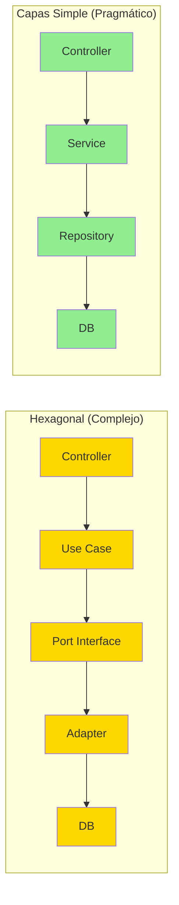
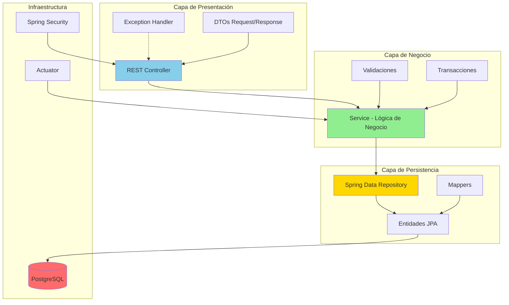
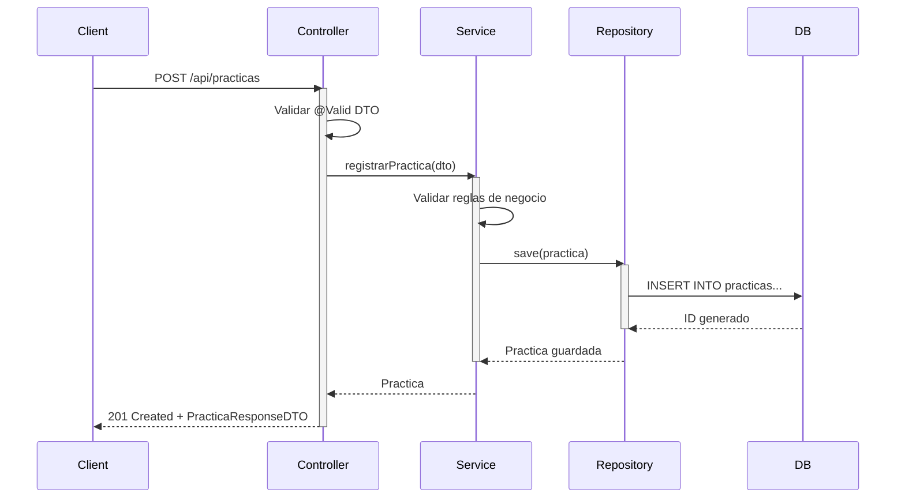
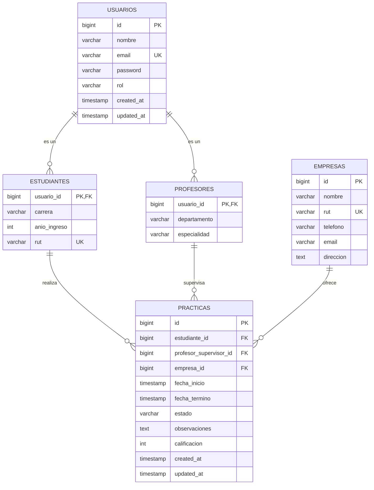
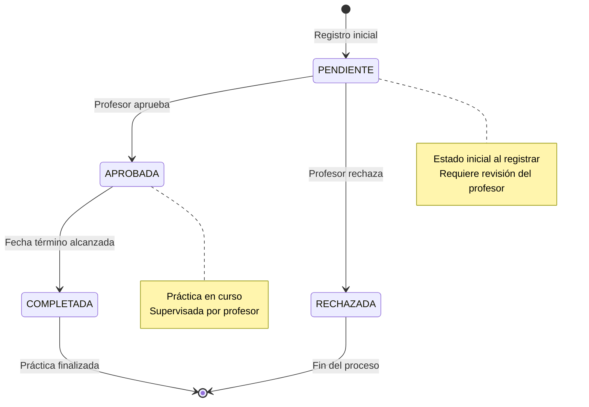

# Sistema de Gestión de Prácticas Profesionales (SGPP)

**Proyecto:** Sistema de seguimiento de prácticas para colegio técnico  
**Arquitectura:** En Capas Simple (Layered Architecture)  
**Stack Tecnológico:** Java 21, Spring Boot 3.58, Spring Data JPA, PostgreSQL  
**Versión:** 1.0  
**Fecha:** Diciembre 2025

---

## 🎯 Filosofía de Esta Versión

**Menos abstracción, más pragmatismo.**

Este documento presenta una arquitectura **simple, directa y mantenible** que aprovecha las convenciones de Spring Boot sin agregar complejidad innecesaria. Perfecta para equipos pequeños, proyectos educativos y sistemas CRUD con lógica de negocio moderada.

---

## Tabla de Contenidos

1. [Análisis y Justificación Técnica]
2. [Arquitectura del Sistema]
3. [Diseño de Base de Datos]
4. [Estructura del Proyecto]
5. [Implementación de Capas]
6. [Seguridad]
7. [Validaciones y Manejo de Errores]
8. [Testing]
9. [Configuración y Optimización]
10. [Despliegue]
11. [Documentación API]
12. [Monitoreo]

---

## FASE 1: ANÁLISIS Y JUSTIFICACIÓN TÉCNICA

### 1.1. ¿Por qué PostgreSQL?

**Seleccionamos PostgreSQL sobre otras alternativas:**

| Característica             | PostgreSQL       | MySQL          | MongoDB     |
| -------------------------- | ---------------- | -------------- | ----------- |
| **Integridad Referencial** | ✅ Excelente     | ✅ Buena       | ❌ Limitada |
| **ACID Completo**          | ✅               | ✅             | ⚠️ Parcial  |
| **JSONB (Flexibilidad)**   | ✅ Nativo        | ⚠️ JSON básico | ✅ Nativo   |
| **Concurrencia**           | ✅ MVCC avanzado | ⚠️ Bloqueos    | ✅ Buena    |
| **Auditoría**              | ✅ Excelente     | ⚠️ Manual      | ⚠️ Manual   |
| **Madurez**                | ✅ 30+ años      | ✅ 25+ años    | ⚠️ 15 años  |

**Conclusión:** PostgreSQL ofrece el mejor balance para un sistema transaccional con necesidades de integridad estricta.

### 1.2. ¿Por qué Arquitectura en Capas Simple?

**Comparación con alternativas:**



**Razones para elegir arquitectura simple:**

✅ **Proyecto CRUD-dominante:** 80% de operaciones son crear/leer/actualizar/eliminar  
✅ **Equipo pequeño:** 1-3 desarrolladores, contexto educativo  
✅ **Lógica de negocio moderada:** Validaciones y estados, no algoritmos complejos  
✅ **Tiempo limitado:** Necesidad de entregar valor rápidamente  
✅ **Bajo riesgo de cambio tecnológico:** Stack establecido (Spring Boot + PostgreSQL)  
✅ **Mantenibilidad:** Más fácil para nuevos desarrolladores

### 1.3. Principios de Diseño

1. **KISS (Keep It Simple, Stupid):** Simplicidad sobre abstracción excesiva
2. **YAGNI (You Aren't Gonna Need It):** No diseñar para el futuro incierto
3. **Convención sobre Configuración:** Aprovechar Spring Boot
4. **Separación de Responsabilidades:** Pero sin sobre-ingeniería
5. **Testing Práctico:** Enfocado en lógica crítica, no 100% de cobertura

---

## FASE 2: ARQUITECTURA DEL SISTEMA

### 2.1. Vista General



### 2.2. Responsabilidades por Capa

| Capa           | Responsabilidad                                                      | Tecnologías                                        | Ejemplos             |
| -------------- | -------------------------------------------------------------------- | -------------------------------------------------- | -------------------- |
| **Controller** | - Recibir requests HTTP<br>- Validar entrada<br>- Retornar responses | `@RestController`<br>`@RequestMapping`<br>`@Valid` | `PracticaController` |
| **Service**    | - Lógica de negocio<br>- Transacciones<br>- Orquestación             | `@Service`<br>`@Transactional`                     | `PracticaService`    |
| **Repository** | - Acceso a datos<br>- Queries                                        | `@Repository`<br>Spring Data JPA                   | `PracticaRepository` |
| **Entity**     | - Modelo de datos<br>- Lógica de dominio simple                      | `@Entity`<br>`@Table`                              | `Practica`           |
| **DTO**        | - Transferencia de datos<br>- Contratos API                          | Java Records<br>Bean Validation                    | `PracticaRequestDTO` |

### 2.3. Flujo de una Petición



---

## FASE 3: DISEÑO DE BASE DE DATOS

### 3.1. Modelo Entidad-Relación



### 3.2. Script SQL de Creación

```sql
-- Tabla base de usuarios
CREATE TABLE usuarios (
    id BIGSERIAL PRIMARY KEY,
    nombre VARCHAR(200) NOT NULL,
    email VARCHAR(150) NOT NULL UNIQUE,
    password VARCHAR(255) NOT NULL,
    rol VARCHAR(50) NOT NULL,
    created_at TIMESTAMP NOT NULL DEFAULT CURRENT_TIMESTAMP,
    updated_at TIMESTAMP NOT NULL DEFAULT CURRENT_TIMESTAMP
);

-- Índice para búsquedas por email (login frecuente)
CREATE INDEX idx_usuarios_email ON usuarios(email);

-- Tabla de estudiantes
CREATE TABLE estudiantes (
    usuario_id BIGINT PRIMARY KEY,
    carrera VARCHAR(100) NOT NULL,
    anio_ingreso INTEGER NOT NULL CHECK (anio_ingreso >= 2000 AND anio_ingreso <= 2100),
    rut VARCHAR(12) NOT NULL UNIQUE,
    CONSTRAINT fk_estudiante_usuario
        FOREIGN KEY (usuario_id) REFERENCES usuarios(id) ON DELETE CASCADE
);

-- Tabla de profesores
CREATE TABLE profesores (
    usuario_id BIGINT PRIMARY KEY,
    departamento VARCHAR(100),
    especialidad VARCHAR(100),
    CONSTRAINT fk_profesor_usuario
        FOREIGN KEY (usuario_id) REFERENCES usuarios(id) ON DELETE CASCADE
);

-- Tabla de empresas
CREATE TABLE empresas (
    id BIGSERIAL PRIMARY KEY,
    nombre VARCHAR(200) NOT NULL,
    rut VARCHAR(12) NOT NULL UNIQUE,
    telefono VARCHAR(20),
    email VARCHAR(150),
    direccion TEXT,
    created_at TIMESTAMP NOT NULL DEFAULT CURRENT_TIMESTAMP
);

-- Tabla de prácticas
CREATE TABLE practicas (
    id BIGSERIAL PRIMARY KEY,
    estudiante_id BIGINT NOT NULL,
    profesor_supervisor_id BIGINT,
    empresa_id BIGINT NOT NULL,
    fecha_inicio TIMESTAMP NOT NULL,
    fecha_termino TIMESTAMP NOT NULL,
    estado VARCHAR(50) NOT NULL DEFAULT 'PENDIENTE',
    observaciones TEXT,
    calificacion INTEGER CHECK (calificacion >= 1 AND calificacion <= 7),
    created_at TIMESTAMP NOT NULL DEFAULT CURRENT_TIMESTAMP,
    updated_at TIMESTAMP NOT NULL DEFAULT CURRENT_TIMESTAMP,

    CONSTRAINT fk_practica_estudiante
        FOREIGN KEY (estudiante_id) REFERENCES estudiantes(usuario_id),
    CONSTRAINT fk_practica_profesor
        FOREIGN KEY (profesor_supervisor_id) REFERENCES profesores(usuario_id),
    CONSTRAINT fk_practica_empresa
        FOREIGN KEY (empresa_id) REFERENCES empresas(id),
    CONSTRAINT chk_fechas
        CHECK (fecha_termino > fecha_inicio)
);

-- Índices para optimización de consultas frecuentes
CREATE INDEX idx_practicas_estudiante ON practicas(estudiante_id);
CREATE INDEX idx_practicas_estado ON practicas(estado);
CREATE INDEX idx_practicas_profesor ON practicas(profesor_supervisor_id);
CREATE INDEX idx_practicas_fechas ON practicas(fecha_inicio, fecha_termino);

-- Trigger para actualizar updated_at automáticamente
CREATE OR REPLACE FUNCTION update_updated_at_column()
RETURNS TRIGGER AS $$
BEGIN
    NEW.updated_at = CURRENT_TIMESTAMP;
    RETURN NEW;
END;
$$ LANGUAGE plpgsql;

CREATE TRIGGER update_usuarios_updated_at BEFORE UPDATE ON usuarios
    FOR EACH ROW EXECUTE FUNCTION update_updated_at_column();

CREATE TRIGGER update_practicas_updated_at BEFORE UPDATE ON practicas
    FOR EACH ROW EXECUTE FUNCTION update_updated_at_column();

-- Datos iniciales para testing
INSERT INTO usuarios (nombre, email, password, rol) VALUES
('Admin Sistema', 'admin@colegio.cl', '$2a$12$LQv3c1yqBWVHxkd0LHAkCOYz6TtxMQJqhN8/LewY5IsGZPg3rGtxu', 'ROLE_ADMIN'),
('Juan Pérez', 'juan.perez@colegio.cl', '$2a$12$LQv3c1yqBWVHxkd0LHAkCOYz6TtxMQJqhN8/LewY5IsGZPg3rGtxu', 'ROLE_PROFESOR'),
('María González', 'maria.gonzalez@estudiante.cl', '$2a$12$LQv3c1yqBWVHxkd0LHAkCOYz6TtxMQJqhN8/LewY5IsGZPg3rGtxu', 'ROLE_ESTUDIANTE');

INSERT INTO profesores (usuario_id, departamento, especialidad) VALUES
(2, 'Informática', 'Desarrollo de Software');

INSERT INTO estudiantes (usuario_id, carrera, anio_ingreso, rut) VALUES
(3, 'Técnico en Programación', 2024, '12345678-9');

INSERT INTO empresas (nombre, rut, telefono, email, direccion) VALUES
('TechCorp SpA', '76123456-7', '+56912345678', 'rrhh@techcorp.cl', 'Av. Providencia 123, Santiago');
```

### 3.3. Estados de Práctica



---

## FASE 4: ESTRUCTURA DEL PROYECTO

### 4.1. Árbol de Directorios

```
src/main/java/cl/colegio/sgpp/
├── SgppApplication.java              # Clase principal
│
├── controller/                        # Capa de Presentación
│   ├── PracticaController.java
│   ├── EstudianteController.java
│   ├── ProfesorController.java
│   └── EmpresaController.java
│
├── service/                           # Capa de Negocio
│   ├── PracticaService.java
│   ├── EstudianteService.java
│   ├── ProfesorService.java
│   ├── EmpresaService.java
│   └── AuthService.java
│
├── repository/                        # Capa de Persistencia
│   ├── PracticaRepository.java
│   ├── EstudianteRepository.java
│   ├── ProfesorRepository.java
│   ├── EmpresaRepository.java
│   └── UsuarioRepository.java
│
├── model/
│   ├── entity/                        # Entidades JPA
│   │   ├── Usuario.java
│   │   ├── Estudiante.java
│   │   ├── Profesor.java
│   │   ├── Empresa.java
│   │   └── Practica.java
│   │
│   └── dto/                           # Data Transfer Objects
│       ├── request/
│       │   ├── PracticaRequestDTO.java
│       │   ├── EstudianteRequestDTO.java
│       │   └── LoginRequestDTO.java
│       └── response/
│           ├── PracticaResponseDTO.java
│           ├── EstudianteResponseDTO.java
│           └── ErrorResponseDTO.java
│
├── exception/                         # Manejo de Errores
│   ├── GlobalExceptionHandler.java
│   ├── ResourceNotFoundException.java
│   ├── BusinessException.java
│   └── ValidationException.java
│
├── config/                            # Configuraciones
│   ├── SecurityConfig.java
│   ├── OpenAPIConfig.java
│   └── CorsConfig.java
│
├── security/                          # Seguridad
│   ├── JwtTokenProvider.java
│   ├── CustomUserDetailsService.java
│   └── JwtAuthenticationFilter.java
│
└── util/                              # Utilidades
    ├── DateUtils.java
    ├── ValidationUtils.java
    └── Constants.java

src/main/resources/
├── application.properties             # Configuración principal
├── application-dev.properties         # Perfil desarrollo
├── application-prod.properties        # Perfil producción
└── db/
    └── migration/                     # Scripts Flyway
        ├── V1__Create_Tables.sql
        ├── V2__Add_Indexes.sql
        └── V3__Initial_Data.sql

src/test/java/cl/colegio/sgpp/
├── controller/
│   └── PracticaControllerTest.java
├── service/
│   └── PracticaServiceTest.java
└── repository/
    └── PracticaRepositoryTest.java
```

### 4.2. Dependencias Maven (pom.xml)

```xml
<?xml version="1.0" encoding="UTF-8"?>
<project xmlns="http://maven.apache.org/POM/4.0.0"
         xmlns:xsi="http://www.w3.org/2001/XMLSchema-instance"
         xsi:schemaLocation="http://maven.apache.org/POM/4.0.0
         https://maven.apache.org/xsd/maven-4.0.0.xsd">
    <modelVersion>4.0.0</modelVersion>

    <parent>
        <groupId>org.springframework.boot</groupId>
        <artifactId>spring-boot-starter-parent</artifactId>
        <version>3.2.0</version>
        <relativePath/>
    </parent>

    <groupId>cl.colegio</groupId>
    <artifactId>sgpp-backend</artifactId>
    <version>1.0.0</version>
    <name>Sistema de Gestión de Prácticas Profesionales</name>
    <description>Backend para gestión de prácticas en colegio técnico</description>

    <properties>
        <java.version>17</java.version>
        <maven.compiler.source>17</maven.compiler.source>
        <maven.compiler.target>17</maven.compiler.target>
        <project.build.sourceEncoding>UTF-8</project.build.sourceEncoding>
    </properties>

    <dependencies>
        <!-- Spring Boot Starters -->
        <dependency>
            <groupId>org.springframework.boot</groupId>
            <artifactId>spring-boot-starter-web</artifactId>
        </dependency>

        <dependency>
            <groupId>org.springframework.boot</groupId>
            <artifactId>spring-boot-starter-data-jpa</artifactId>
        </dependency>

        <dependency>
            <groupId>org.springframework.boot</groupId>
            <artifactId>spring-boot-starter-security</artifactId>
        </dependency>

        <dependency>
            <groupId>org.springframework.boot</groupId>
            <artifactId>spring-boot-starter-validation</artifactId>
        </dependency>

        <dependency>
            <groupId>org.springframework.boot</groupId>
            <artifactId>spring-boot-starter-actuator</artifactId>
        </dependency>

        <!-- Base de Datos -->
        <dependency>
            <groupId>org.postgresql</groupId>
            <artifactId>postgresql</artifactId>
            <scope>runtime</scope>
        </dependency>

        <!-- Migraciones -->
        <dependency>
            <groupId>org.flywaydb</groupId>
            <artifactId>flyway-core</artifactId>
        </dependency>

        <dependency>
            <groupId>org.flywaydb</groupId>
            <artifactId>flyway-database-postgresql</artifactId>
        </dependency>

        <!-- Documentación API -->
        <dependency>
            <groupId>org.springdoc</groupId>
            <artifactId>springdoc-openapi-starter-webmvc-ui</artifactId>
            <version>2.3.0</version>
        </dependency>

        <!-- JWT -->
        <dependency>
            <groupId>io.jsonwebtoken</groupId>
            <artifactId>jjwt-api</artifactId>
            <version>0.12.3</version>
        </dependency>
        <dependency>
            <groupId>io.jsonwebtoken</groupId>
            <artifactId>jjwt-impl</artifactId>
            <version>0.12.3</version>
            <scope>runtime</scope>
        </dependency>
        <dependency>
            <groupId>io.jsonwebtoken</groupId>
            <artifactId>jjwt-jackson</artifactId>
            <version>0.12.3</version>
            <scope>runtime</scope>
        </dependency>

        <!-- Lombok (Opcional - reduce boilerplate) -->
        <dependency>
            <groupId>org.projectlombok</groupId>
            <artifactId>lombok</artifactId>
            <optional>true</optional>
        </dependency>

        <!-- Testing -->
        <dependency>
            <groupId>org.springframework.boot</groupId>
            <artifactId>spring-boot-starter-test</artifactId>
            <scope>test</scope>
        </dependency>

        <dependency>
            <groupId>org.springframework.security</groupId>
            <artifactId>spring-security-test</artifactId>
            <scope>test</scope>
        </dependency>

        <dependency>
            <groupId>com.h2database</groupId>
            <artifactId>h2</artifactId>
            <scope>test</scope>
        </dependency>
    </dependencies>

    <build>
        <plugins>
            <plugin>
                <groupId>org.springframework.boot</groupId>
                <artifactId>spring-boot-maven-plugin</artifactId>
            </plugin>
        </plugins>
    </build>
</project>
```

---

## FASE 5: IMPLEMENTACIÓN DE CAPAS

### 5.1. Capa de Entidades (Model)

**Usuario.java (Clase base)**

```java
package cl.colegio.sgpp.model.entity;

import jakarta.persistence.*;
import lombok.Data;
import lombok.NoArgsConstructor;
import lombok.AllArgsConstructor;
import org.springframework.data.annotation.CreatedDate;
import org.springframework.data.annotation.LastModifiedDate;
import org.springframework.data.jpa.domain.support.AuditingEntityListener;

import java.time.LocalDateTime;

@Entity
@Table(name = "usuarios")
@Inheritance(strategy = InheritanceType.JOINED)
@EntityListeners(AuditingEntityListener.class)
@Data
@NoArgsConstructor
@AllArgsConstructor
public class Usuario {

    @Id
    @GeneratedValue(strategy = GenerationType.IDENTITY)
    private Long id;

    @Column(nullable = false, length = 200)
    private String nombre;

    @Column(nullable = false, unique = true, length = 150)
    private String email;

    @Column(nullable = false)
    private String password;

    @Column(nullable = false, length = 50)
    private String rol; // ROLE_ESTUDIANTE, ROLE_PROFESOR, ROLE_ADMIN

    @CreatedDate
    @Column(name = "created_at", nullable = false, updatable = false)
    private LocalDateTime createdAt;

    @LastModifiedDate
    @Column(name = "updated_at", nullable = false)
    private LocalDateTime updatedAt;
}
```

**Estudiante.java**

```java
package cl.colegio.sgpp.model.entity;

import jakarta.persistence.*;
import lombok.Data;
import lombok.EqualsAndHashCode;
import lombok.NoArgsConstructor;
import lombok.AllArgsConstructor;

import java.util.ArrayList;
import java.util.List;

@Entity
@Table(name = "estudiantes")
@PrimaryKeyJoinColumn(name = "usuario_id")
@Data
@EqualsAndHashCode(callSuper = true)
@NoArgsConstructor
@AllArgsConstructor
public class Estudiante extends Usuario {

    @Column(nullable = false, length = 100)
    private String carrera;

    @Column(name = "anio_ingreso", nullable = false)
    private Integer anioIngreso;

    @Column(nullable = false, unique = true, length = 12)
    private String rut;

    @OneToMany(mappedBy = "estudiante", cascade = CascadeType.ALL)
    private List<Practica> practicas = new ArrayList<>();
}
```

**Profesor.java**

```java
package cl.colegio.sgpp.model.entity;

import jakarta.persistence.*;
import lombok.Data;
import lombok.EqualsAndHashCode;
import lombok.NoArgsConstructor;
import lombok.AllArgsConstructor;

import java.util.ArrayList;
import java.util.List;

@Entity
@Table(name = "profesores")
@PrimaryKeyJoinColumn(name = "usuario_id")
@Data
@EqualsAndHashCode(callSuper = true)
@NoArgsConstructor
@AllArgsConstructor
public class Profesor extends Usuario {

    @Column(length = 100)
    private String departamento;

    @Column(length = 100)
    private String especialidad;

    @OneToMany(mappedBy = "profesorSupervisor")
    private List<Practica> practicasSupervisadas = new ArrayList<>();
}
```

**Empresa.java**

```java
package cl.colegio.sgpp.model.entity;

import jakarta.persistence.*;
import lombok.Data;
import lombok.NoArgsConstructor;
import lombok.AllArgsConstructor;
import org.springframework.data.annotation.CreatedDate;
import org.springframework.data.jpa.domain.support.AuditingEntityListener;

import java.time.LocalDateTime;
import java.util.ArrayList;
import java.util.List;

@Entity
@Table(name = "empresas")
@EntityListeners(AuditingEntityListener.class)
@Data
@NoArgsConstructor
@AllArgsConstructor
public class Empresa {

    @Id
    @GeneratedValue(strategy = GenerationType.IDENTITY)
    private Long id;

    @Column(nullable = false, length = 200)
    private String nombre;

    @Column(nullable = false, unique = true, length = 12)
    private String rut;

    @Column(length = 20)
    private String telefono;

    @Column(length = 150)
    private String email;

    @Column(columnDefinition = "TEXT")
    private String direccion;

    @CreatedDate
    @Column(name = "created_at", nullable = false, updatable = false)
    private LocalDateTime createdAt;

    @OneToMany(mappedBy = "empresa")
    private List<Practica> practicas = new ArrayList<>();
}
```

**Practica.java (Entidad Principal)**

```java
package cl.colegio.sgpp.model.entity;

import jakarta.persistence.*;
import lombok.Data;
import lombok.NoArgsConstructor;
import lombok.AllArgsConstructor;
import org.springframework.data.annotation.CreatedDate;
import org.springframework.data.annotation.LastModifiedDate;
import org.springframework.data.jpa.domain.support.AuditingEntityListener;

import java.time.LocalDateTime;

@Entity
@Table(name = "practicas")
@EntityListeners(AuditingEntityListener.class)
@Data
@NoArgsConstructor
@AllArgsConstructor
public class Practica {

    @Id
    @GeneratedValue(strategy = GenerationType.IDENTITY)
    private Long id;

    @ManyToOne(fetch = FetchType.LAZY)
    @JoinColumn(name = "estudiante_id", nullable = false)
    private Estudiante estudiante;

    @ManyToOne(fetch = FetchType.LAZY)
    @JoinColumn(name = "profesor_supervisor_id")
    private Profesor profesorSupervisor;

    @ManyToOne(fetch = FetchType.LAZY)
    @JoinColumn(name = "empresa_id", nullable = false)
    private Empresa empresa;

    @Column(name = "fecha_inicio", nullable = false)
    private LocalDateTime fechaInicio;

    @Column(name = "fecha_termino", nullable = false)
    private LocalDateTime fechaTermino;

    @Column(nullable = false, length = 50)
    private String estado = "PENDIENTE"; // PENDIENTE, APROBADA, RECHAZADA, COMPLETADA

    @Column(columnDefinition = "TEXT")
    private String observaciones;

    @Column
    private Integer calificacion; // 1-7

    @CreatedDate
    @Column(name = "created_at", nullable = false, updatable = false)
    private LocalDateTime createdAt;

    @LastModifiedDate
    @Column(name = "updated_at", nullable = false)
    private LocalDateTime updatedAt;

    // ============================================
    // LÓGICA DE NEGOCIO (Domain Logic)
    // ============================================

    /**
     * Aprueba la práctica si está en estado PENDIENTE
     */
    public void aprobar() {
        if (!"PENDIENTE".equals(this.estado)) {
            throw new IllegalStateException(
                "Solo se pueden aprobar prácticas en estado PENDIENTE. Estado actual: " + this.estado
            );
        }
        this.estado = "APROBADA";
    }

    /**
     * Rechaza la práctica si está en estado PENDIENTE
     */
    public void rechazar(String motivo) {
        if (!"PENDIENTE".equals(this.estado)) {
            throw new IllegalStateException(
                "Solo se pueden rechazar prácticas en estado PENDIENTE. Estado actual: " + this.estado
            );
        }
        this.estado = "RECHAZADA";
        this.observaciones = motivo;
    }

    /**
     * Marca la práctica como completada si está aprobada y la fecha término ha pasado
     */
    public void completar(Integer calificacionFinal) {
        if (!"APROBADA".equals(this.estado)) {
            throw new IllegalStateException(
                "Solo se pueden completar prácticas en estado APROBADA. Estado actual: " + this.estado
            );
        }
        if (LocalDateTime.now().isBefore(this.fechaTermino)) {
            throw new IllegalStateException(
                "No se puede completar una práctica antes de su fecha de término"
            );
        }
        if (calificacionFinal < 1 || calificacionFinal > 7) {
            throw new IllegalArgumentException(
                "La calificación debe estar entre 1 y 7"
            );
        }
        this.estado = "COMPLETADA";
        this.calificacion = calificacionFinal;
    }

    /**
     * Valida que las fechas sean coherentes
     */
    @PrePersist
    @PreUpdate
    public void validarFechas() {
        if (fechaTermino != null && fechaInicio != null &&
            fechaTermino.isBefore(fechaInicio)) {
            throw new IllegalArgumentException(
                "La fecha de término no puede ser anterior a la fecha de inicio"
            );
        }
    }
}
```

### 5.2. Capa de DTOs

**PracticaRequestDTO.java**

```java
package cl.colegio.sgpp.model.dto.request;

import jakarta.validation.constraints.*;
import lombok.Data;

import java.time.LocalDateTime;

@Data
public class PracticaRequestDTO {

    @NotNull(message = "El ID del estudiante es obligatorio")
    @Positive(message = "El ID del estudiante debe ser positivo")
    private Long estudianteId;

    @Positive(message = "El ID del profesor debe ser positivo")
    private Long profesorSupervisorId;

    @NotNull(message = "El ID de la empresa es obligatorio")
    @Positive(message = "El ID de la empresa debe ser positivo")
    private Long empresaId;

    @NotNull(message = "La fecha de inicio es obligatoria")
    @FutureOrPresent(message = "La fecha de inicio no puede ser en el pasado")
    private LocalDateTime fechaInicio;

    @NotNull(message = "La fecha de término es obligatoria")
    @Future(message = "La fecha de término debe ser futura")
    private LocalDateTime fechaTermino;

    @Size(max = 500, message = "Las observaciones no pueden superar 500 caracteres")
    private String observaciones;

    // Validación personalizada
    @AssertTrue(message = "La fecha de término debe ser posterior a la fecha de inicio")
    public boolean isFechasValidas() {
        if (fechaInicio == null || fechaTermino == null) {
            return true; // Dejar que @NotNull maneje esto
        }
        return fechaTermino.isAfter(fechaInicio);
    }
}
```

**PracticaResponseDTO.java**

```java
package cl.colegio.sgpp.model.dto.response;

import cl.colegio.sgpp.model.entity.Practica;
import lombok.AllArgsConstructor;
import lombok.Builder;
import lombok.Data;
import lombok.NoArgsConstructor;

import java.time.LocalDateTime;

@Data
@Builder
@NoArgsConstructor
@AllArgsConstructor
public class PracticaResponseDTO {

    private Long id;
    private String estudianteNombre;
    private String estudianteRut;
    private String profesorNombre;
    private String empresaNombre;
    private LocalDateTime fechaInicio;
    private LocalDateTime fechaTermino;
    private String estado;
    private String observaciones;
    private Integer calificacion;
    private LocalDateTime createdAt;
    private LocalDateTime updatedAt;

    /**
     * Factory method para convertir entidad a DTO
     */
    public static PracticaResponseDTO from(Practica practica) {
        return PracticaResponseDTO.builder()
            .id(practica.getId())
            .estudianteNombre(practica.getEstudiante().getNombre())
            .estudianteRut(practica.getEstudiante().getRut())
            .profesorNombre(practica.getProfesорSupervisor() != null ?
                practica.getProfesorSupervisor().getNombre() : null)
            .empresaNombre(practica.getEmpresa().getNombre())
            .fechaInicio(practica.getFechaInicio())
            .fechaTermino(practica.getFechaTermino())
            .estado(practica.getEstado())
            .observaciones(practica.getObservaciones())
            .calificacion(practica.getCalificacion())
            .createdAt(practica.getCreatedAt())
            .updatedAt(practica.getUpdatedAt())
            .build();
    }
}
```

**ErrorResponseDTO.java**

```java
package cl.colegio.sgpp.model.dto.response;

import lombok.AllArgsConstructor;
import lombok.Builder;
import lombok.Data;
import lombok.NoArgsConstructor;

import java.time.LocalDateTime;
import java.util.List;

@Data
@Builder
@NoArgsConstructor
@AllArgsConstructor
public class ErrorResponseDTO {

    private LocalDateTime timestamp;
    private int status;
    private String error;
    private String message;
    private String path;
    private List<String> details;

    public static ErrorResponseDTO of(int status, String error, String message, String path) {
        return ErrorResponseDTO.builder()
            .timestamp(LocalDateTime.now())
            .status(status)
            .error(error)
            .message(message)
            .path(path)
            .build();
    }
}
```

### 5.3. Capa de Repositorio

**PracticaRepository.java**

```java
package cl.colegio.sgpp.repository;

import cl.colegio.sgpp.model.entity.Practica;
import org.springframework.data.domain.Page;
import org.springframework.data.domain.Pageable;
import org.springframework.data.jpa.repository.JpaRepository;
import org.springframework.data.jpa.repository.Query;
import org.springframework.data.repository.query.Param;
import org.springframework.stereotype.Repository;

import java.time.LocalDateTime;
import java.util.List;
import java.util.Optional;

@Repository
public interface PracticaRepository extends JpaRepository<Practica, Long> {

    // Consultas por estudiante
    List<Practica> findByEstudianteId(Long estudianteId);

    Page<Practica> findByEstudianteId(Long estudianteId, Pageable pageable);

    // Consultas por estado
    List<Practica> findByEstado(String estado);

    Page<Practica> findByEstado(String estado, Pageable pageable);

    // Consultas por profesor
    List<Practica> findByProfesorSupervisorId(Long profesorId);

    Page<Practica> findByProfesorSupervisorId(Long profesorId, Pageable pageable);

    // Consultas por empresa
    List<Practica> findByEmpresaId(Long empresaId);

    // Consultas por rango de fechas
    @Query("SELECT p FROM Practica p WHERE p.fechaInicio >= :desde AND p.fechaTermino <= :hasta")
    List<Practica> findByRangoFechas(
        @Param("desde") LocalDateTime desde,
        @Param("hasta") LocalDateTime hasta
    );

    // Consulta con fetch join para evitar N+1
    @Query("SELECT p FROM Practica p " +
           "LEFT JOIN FETCH p.estudiante " +
           "LEFT JOIN FETCH p.profesorSupervisor " +
           "LEFT JOIN FETCH p.empresa " +
           "WHERE p.id = :id")
    Optional<Practica> findByIdWithDetails(@Param("id") Long id);

    // Contar prácticas por estado
    long countByEstado(String estado);

    // Verificar si estudiante tiene práctica activa
    @Query("SELECT COUNT(p) > 0 FROM Practica p " +
           "WHERE p.estudiante.id = :estudianteId " +
           "AND p.estado IN ('PENDIENTE', 'APROBADA')")
    boolean estudianteTienePracticaActiva(@Param("estudianteId") Long estudianteId);
}
```

**EstudianteRepository.java**

```java
package cl.colegio.sgpp.repository;

import cl.colegio.sgpp.model.entity.Estudiante;
import org.springframework.data.jpa.repository.JpaRepository;
import org.springframework.stereotype.Repository;

import java.util.Optional;

@Repository
public interface EstudianteRepository extends JpaRepository<Estudiante, Long> {

    Optional<Estudiante> findByEmail(String email);

    Optional<Estudiante> findByRut(String rut);

    boolean existsByRut(String rut);

    boolean existsByEmail(String email);
}
```

**ProfesorRepository.java**

```java
package cl.colegio.sgpp.repository;

import cl.colegio.sgpp.model.entity.Profesor;
import org.springframework.data.jpa.repository.JpaRepository;
import org.springframework.stereotype.Repository;

import java.util.List;
import java.util.Optional;

@Repository
public interface ProfesorRepository extends JpaRepository<Profesor, Long> {

    Optional<Profesor> findByEmail(String email);

    List<Profesor> findByDepartamento(String departamento);
}
```

**EmpresaRepository.java**

```java
package cl.colegio.sgpp.repository;

import cl.colegio.sgpp.model.entity.Empresa;
import org.springframework.data.jpa.repository.JpaRepository;
import org.springframework.stereotype.Repository;

import java.util.Optional;

@Repository
public interface EmpresaRepository extends JpaRepository<Empresa, Long> {

    Optional<Empresa> findByRut(String rut);

    boolean existsByRut(String rut);
}
```

### 5.4. Capa de Servicio

**PracticaService.java**

```java
package cl.colegio.sgpp.service;

import cl.colegio.sgpp.exception.BusinessException;
import cl.colegio.sgpp.exception.ResourceNotFoundException;
import cl.colegio.sgpp.model.dto.request.PracticaRequestDTO;
import cl.colegio.sgpp.model.dto.response.PracticaResponseDTO;
import cl.colegio.sgpp.model.entity.Empresa;
import cl.colegio.sgpp.model.entity.Estudiante;
import cl.colegio.sgpp.model.entity.Practica;
import cl.colegio.sgpp.model.entity.Profesor;
import cl.colegio.sgpp.repository.*;
import lombok.RequiredArgsConstructor;
import lombok.extern.slf4j.Slf4j;
import org.springframework.data.domain.Page;
import org.springframework.data.domain.Pageable;
import org.springframework.stereotype.Service;
import org.springframework.transaction.annotation.Transactional;

import java.util.List;
import java.util.stream.Collectors;

@Service
@RequiredArgsConstructor
@Slf4j
public class PracticaService {

    private final PracticaRepository practicaRepository;
    private final EstudianteRepository estudianteRepository;
    private final ProfesorRepository profesorRepository;
    private final EmpresaRepository empresaRepository;

    /**
     * Registra una nueva práctica
     */
    @Transactional
    public PracticaResponseDTO registrarPractica(PracticaRequestDTO request) {
        log.info("Registrando nueva práctica para estudiante ID: {}", request.getEstudianteId());

        // Validar que el estudiante existe
        Estudiante estudiante = estudianteRepository.findById(request.getEstudianteId())
            .orElseThrow(() -> new ResourceNotFoundException(
                "Estudiante no encontrado con ID: " + request.getEstudianteId()
            ));

        // Validar que no tenga práctica activa
        if (practicaRepository.estudianteTienePracticaActiva(estudiante.getId())) {
            throw new BusinessException(
                "El estudiante ya tiene una práctica activa (PENDIENTE o APROBADA)"
            );
        }

        // Validar que la empresa existe
        Empresa empresa = empresaRepository.findById(request.getEmpresaId())
            .orElseThrow(() -> new ResourceNotFoundException(
                "Empresa no encontrada con ID: " + request.getEmpresaId()
            ));

        // Validar profesor (opcional)
        Profesor profesor = null;
        if (request.getProfesorSupervisorId() != null) {
            profesor = profesorRepository.findById(request.getProfesorSupervisorId())
                .orElseThrow(() -> new ResourceNotFoundException(
                    "Profesor no encontrado con ID: " + request.getProfesorSupervisorId()
                ));
        }

        // Crear la práctica
        Practica practica = new Practica();
        practica.setEstudiante(estudiante);
        practica.setProfesорSupervisor(profesor);
        practica.setEmpresa(empresa);
        practica.setFechaInicio(request.getFechaInicio());
        practica.setFechaTermino(request.getFechaTermino());
        practica.setObservaciones(request.getObservaciones());
        practica.setEstado("PENDIENTE");

        // Guardar
        Practica guardada = practicaRepository.save(practica);

        log.info("Práctica registrada exitosamente con ID: {}", guardada.getId());
        return PracticaResponseDTO.from(guardada);
    }

    /**
     * Obtiene una práctica por ID
     */
    @Transactional(readOnly = true)
    public PracticaResponseDTO obtenerPorId(Long id) {
        Practica practica = practicaRepository.findByIdWithDetails(id)
            .orElseThrow(() -> new ResourceNotFoundException(
                "Práctica no encontrada con ID: " + id
            ));

        return PracticaResponseDTO.from(practica);
    }

    /**
     * Lista todas las prácticas con paginación
     */
    @Transactional(readOnly = true)
    public Page<PracticaResponseDTO> listarTodas(Pageable pageable) {
        return practicaRepository.findAll(pageable)
            .map(PracticaResponseDTO::from);
    }

    /**
     * Lista prácticas por estudiante
     */
    @Transactional(readOnly = true)
    public List<PracticaResponseDTO> listarPorEstudiante(Long estudianteId) {
        return practicaRepository.findByEstudianteId(estudianteId).stream()
            .map(PracticaResponseDTO::from)
            .collect(Collectors.toList());
    }

    /**
     * Lista prácticas por estado
     */
    @Transactional(readOnly = true)
    public Page<PracticaResponseDTO> listarPorEstado(String estado, Pageable pageable) {
        return practicaRepository.findByEstado(estado, pageable)
            .map(PracticaResponseDTO::from);
    }

    /**
     * Aprueba una práctica (solo profesores)
     */
    @Transactional
    public PracticaResponseDTO aprobarPractica(Long id) {
        log.info("Aprobando práctica ID: {}", id);

        Practica practica = practicaRepository.findById(id)
            .orElseThrow(() -> new ResourceNotFoundException(
                "Práctica no encontrada con ID: " + id
            ));

        // La lógica de negocio está en la entidad
        practica.aprobar();

        Practica actualizada = practicaRepository.save(practica);

        log.info("Práctica ID: {} aprobada exitosamente", id);
        return PracticaResponseDTO.from(actualizada);
    }

    /**
     * Rechaza una práctica (solo profesores)
     */
    @Transactional
    public PracticaResponseDTO rechazarPractica(Long id, String motivo) {
        log.info("Rechazando práctica ID: {}", id);

        Practica practica = practicaRepository.findById(id)
            .orElseThrow(() -> new ResourceNotFoundException(
                "Práctica no encontrada con ID: " + id
            ));

        practica.rechazar(motivo);

        Practica actualizada = practicaRepository.save(practica);

        log.info("Práctica ID: {} rechazada", id);
        return PracticaResponseDTO.from(actualizada);
    }

    /**
     * Completa una práctica con calificación
     */
    @Transactional
    public PracticaResponseDTO completarPractica(Long id, Integer calificacion) {
        log.info("Completando práctica ID: {} con calificación: {}", id, calificacion);

        Practica practica = practicaRepository.findById(id)
            .orElseThrow(() -> new ResourceNotFoundException(
                "Práctica no encontrada con ID: " + id
            ));

        practica.completar(calificacion);

        Practica actualizada = practicaRepository.save(practica);

        log.info("Práctica ID: {} completada exitosamente", id);
        return PracticaResponseDTO.from(actualizada);
    }

    /**
     * Actualiza una práctica
     */
    @Transactional
    public PracticaResponseDTO actualizarPractica(Long id, PracticaRequestDTO request) {
        log.info("Actualizando práctica ID: {}", id);

        Practica practica = practicaRepository.findById(id)
            .orElseThrow(() -> new ResourceNotFoundException(
                "Práctica no encontrada con ID: " + id
            ));

        // Actualizar campos
        if (request.getFechaInicio() != null) {
            practica.setFechaInicio(request.getFechaInicio());
        }
        if (request.getFechaTermino() != null) {
            practica.setFechaTermino(request.getFechaTermino());
        }
        if (request.getObservaciones() != null) {
            practica.setObservaciones(request.getObservaciones());
        }

        Practica actualizada = practicaRepository.save(practica);

        log.info("Práctica ID: {} actualizada exitosamente", id);
        return PracticaResponseDTO.from(actualizada);
    }

    /**
     * Elimina una práctica (solo admin)
     */
    @Transactional
    public void eliminarPractica(Long id) {
        log.info("Eliminando práctica ID: {}", id);

        if (!practicaRepository.existsById(id)) {
            throw new ResourceNotFoundException(
                "Práctica no encontrada con ID: " + id
            );
        }

        practicaRepository.deleteById(id);
        log.info("Práctica ID: {} eliminada exitosamente", id);
    }
}
```

### 5.5. Capa de Controlador

**PracticaController.java**

```java
package cl.colegio.sgpp.controller;

import cl.colegio.sgpp.model.dto.request.PracticaRequestDTO;
import cl.colegio.sgpp.model.dto.response.PracticaResponseDTO;
import cl.colegio.sgpp.service.PracticaService;
import io.swagger.v3.oas.annotations.Operation;
import io.swagger.v3.oas.annotations.Parameter;
import io.swagger.v3.oas.annotations.responses.ApiResponse;
import io.swagger.v3.oas.annotations.responses.ApiResponses;
import io.swagger.v3.oas.annotations.security.SecurityRequirement;
import io.swagger.v3.oas.annotations.tags.Tag;
import jakarta.validation.Valid;
import lombok.RequiredArgsConstructor;
import org.springframework.data.domain.Page;
import org.springframework.data.domain.PageRequest;
import org.springframework.data.domain.Pageable;
import org.springframework.data.domain.Sort;
import org.springframework.http.HttpStatus;
import org.springframework.http.ResponseEntity;
import org.springframework.security.access.prepost.PreAuthorize;
import org.springframework.web.bind.annotation.*;

import java.util.List;

@RestController
@RequestMapping("/api/practicas")
@RequiredArgsConstructor
@Tag(name = "Prácticas", description = "API para gestión de prácticas profesionales")
@SecurityRequirement(name = "basicAuth")
public class PracticaController {

    private final PracticaService practicaService;

    @Operation(summary = "Registrar nueva práctica")
    @ApiResponses(value = {
        @ApiResponse(responseCode = "201", description = "Práctica creada exitosamente"),
        @ApiResponse(responseCode = "400", description = "Datos inválidos"),
        @ApiResponse(responseCode = "403", description = "No autorizado"),
        @ApiResponse(responseCode = "404", description = "Estudiante o empresa no encontrado")
    })
    @PostMapping
    @PreAuthorize("hasAnyRole('ESTUDIANTE', 'PROFESOR', 'ADMIN')")
    public ResponseEntity<PracticaResponseDTO> registrar(
            @Valid @RequestBody PracticaRequestDTO request) {

        PracticaResponseDTO response = practicaService.registrarPractica(request);
        return ResponseEntity.status(HttpStatus.CREATED).body(response);
    }

    @Operation(summary = "Obtener práctica por ID")
    @GetMapping("/{id}")
    @PreAuthorize("hasAnyRole('ESTUDIANTE', 'PROFESOR', 'ADMIN')")
    public ResponseEntity<PracticaResponseDTO> obtenerPorId(
            @Parameter(description = "ID de la práctica") @PathVariable Long id) {

        PracticaResponseDTO response = practicaService.obtenerPorId(id);
        return ResponseEntity.ok(response);
    }

    @Operation(summary = "Listar todas las prácticas (paginado)")
    @GetMapping
    @PreAuthorize("hasAnyRole('PROFESOR', 'ADMIN')")
    public ResponseEntity<Page<PracticaResponseDTO>> listarTodas(
            @Parameter(description = "Número de página (0-indexed)")
            @RequestParam(defaultValue = "0") int page,
            @Parameter(description = "Tamaño de página")
            @RequestParam(defaultValue = "10") int size,
            @Parameter(description = "Campo para ordenar")
            @RequestParam(defaultValue = "createdAt") String sortBy,
            @Parameter(description = "Dirección: ASC o DESC")
            @RequestParam(defaultValue = "DESC") String direction) {

        Sort sort = direction.equalsIgnoreCase("ASC") ?
            Sort.by(sortBy).ascending() : Sort.by(sortBy).descending();

        Pageable pageable = PageRequest.of(page, size, sort);
        Page<PracticaResponseDTO> response = practicaService.listarTodas(pageable);

        return ResponseEntity.ok(response);
    }

    @Operation(summary = "Listar prácticas de un estudiante")
    @GetMapping("/estudiante/{estudianteId}")
    @PreAuthorize("hasAnyRole('ESTUDIANTE', 'PROFESOR', 'ADMIN')")
    public ResponseEntity<List<PracticaResponseDTO>> listarPorEstudiante(
            @PathVariable Long estudianteId) {

        List<PracticaResponseDTO> response = practicaService.listarPorEstudiante(estudianteId);
        return ResponseEntity.ok(response);
    }

    @Operation(summary = "Listar prácticas por estado")
    @GetMapping("/estado/{estado}")
    @PreAuthorize("hasAnyRole('PROFESOR', 'ADMIN')")
    public ResponseEntity<Page<PracticaResponseDTO>> listarPorEstado(
            @PathVariable String estado,
            @RequestParam(defaultValue = "0") int page,
            @RequestParam(defaultValue = "10") int size) {

        Pageable pageable = PageRequest.of(page, size);
        Page<PracticaResponseDTO> response = practicaService.listarPorEstado(estado, pageable);

        return ResponseEntity.ok(response);
    }

    @Operation(summary = "Aprobar práctica (solo profesores)")
    @PostMapping("/{id}/aprobar")
    @PreAuthorize("hasAnyRole('PROFESOR', 'ADMIN')")
    public ResponseEntity<PracticaResponseDTO> aprobar(@PathVariable Long id) {
        PracticaResponseDTO response = practicaService.aprobarPractica(id);
        return ResponseEntity.ok(response);
    }

    @Operation(summary = "Rechazar práctica (solo profesores)")
    @PostMapping("/{id}/rechazar")
    @PreAuthorize("hasAnyRole('PROFESOR', 'ADMIN')")
    public ResponseEntity<PracticaResponseDTO> rechazar(
            @PathVariable Long id,
            @RequestParam String motivo) {

        PracticaResponseDTO response = practicaService.rechazarPractica(id, motivo);
        return ResponseEntity.ok(response);
    }

    @Operation(summary = "Completar práctica con calificación")
    @PostMapping("/{id}/completar")
    @PreAuthorize("hasAnyRole('PROFESOR', 'ADMIN')")
    public ResponseEntity<PracticaResponseDTO> completar(
            @PathVariable Long id,
            @RequestParam Integer calificacion) {

        PracticaResponseDTO response = practicaService.completarPractica(id, calificacion);
        return ResponseEntity.ok(response);
    }

    @Operation(summary = "Actualizar práctica")
    @PutMapping("/{id}")
    @PreAuthorize("hasAnyRole('PROFESOR', 'ADMIN')")
    public ResponseEntity<PracticaResponseDTO> actualizar(
            @PathVariable Long id,
            @Valid @RequestBody PracticaRequestDTO request) {

        PracticaResponseDTO response = practicaService.actualizarPractica(id, request);
        return ResponseEntity.ok(response);
    }

    @Operation(summary = "Eliminar práctica (solo admin)")
    @DeleteMapping("/{id}")
    @PreAuthorize("hasRole('ADMIN')")
    public ResponseEntity<Void> eliminar(@PathVariable Long id) {
        practicaService.eliminarPractica(id);
        return ResponseEntity.noContent().build();
    }
}
```

---

## FASE 6: SEGURIDAD

### 6.1. Configuración de Spring Security

**SecurityConfig.java**

```java
package cl.colegio.sgpp.config;

import lombok.RequiredArgsConstructor;
import org.springframework.context.annotation.Bean;
import org.springframework.context.annotation.Configuration;
import org.springframework.http.HttpMethod;
import org.springframework.security.authentication.AuthenticationManager;
import org.springframework.security.config.annotation.authentication.configuration.AuthenticationConfiguration;
import org.springframework.security.config.annotation.method.configuration.EnableMethodSecurity;
import org.springframework.security.config.annotation.web.builders.HttpSecurity;
import org.springframework.security.config.annotation.web.configuration.EnableWebSecurity;
import org.springframework.security.config.http.SessionCreationPolicy;
import org.springframework.security.crypto.bcrypt.BCryptPasswordEncoder;
import org.springframework.security.crypto.password.PasswordEncoder;
import org.springframework.security.web.SecurityFilterChain;
import org.springframework.web.cors.CorsConfiguration;
import org.springframework.web.cors.CorsConfigurationSource;
import org.springframework.web.cors.UrlBasedCorsConfigurationSource;

import java.util.Arrays;

@Configuration
@EnableWebSecurity
@EnableMethodSecurity(prePostEnabled = true)
@RequiredArgsConstructor
public class SecurityConfig {

    @Bean
    public SecurityFilterChain filterChain(HttpSecurity http) throws Exception {
        http
            .csrf(csrf -> csrf.disable())
            .cors(cors -> cors.configurationSource(corsConfigurationSource()))
            .sessionManagement(session ->
                session.sessionCreationPolicy(SessionCreationPolicy.STATELESS))
            .authorizeHttpRequests(auth -> auth
                // Endpoints públicos
                .requestMatchers("/auth/**", "/swagger-ui/**", "/v3/api-docs/**").permitAll()
                .requestMatchers("/actuator/health").permitAll()

                // Endpoints de prácticas
                .requestMatchers(HttpMethod.POST, "/api/practicas").hasAnyRole("ESTUDIANTE", "PROFESOR", "ADMIN")
                .requestMatchers(HttpMethod.GET, "/api/practicas/estudiante/**").hasAnyRole("ESTUDIANTE", "PROFESOR", "ADMIN")
                .requestMatchers(HttpMethod.GET, "/api/practicas/**").hasAnyRole("PROFESOR", "ADMIN")
                .requestMatchers(HttpMethod.PUT, "/api/practicas/**").hasAnyRole("PROFESOR", "ADMIN")
                .requestMatchers(HttpMethod.DELETE, "/api/practicas/**").hasRole("ADMIN")

                .anyRequest().authenticated()
            )
            .httpBasic(basic -> {});

        return http.build();
    }

    @Bean
    public CorsConfigurationSource corsConfigurationSource() {
        CorsConfiguration configuration = new CorsConfiguration();
        configuration.setAllowedOrigins(Arrays.asList("http://localhost:3000", "http://localhost:4200"));
        configuration.setAllowedMethods(Arrays.asList("GET", "POST", "PUT", "DELETE", "OPTIONS"));
        configuration.setAllowedHeaders(Arrays.asList("*"));
        configuration.setAllowCredentials(true);

        UrlBasedCorsConfigurationSource source = new UrlBasedCorsConfigurationSource();
        source.registerCorsConfiguration("/**", configuration);
        return source;
    }

    @Bean
    public PasswordEncoder passwordEncoder() {
        return new BCryptPasswordEncoder(12);
    }

    @Bean
    public AuthenticationManager authenticationManager(
            AuthenticationConfiguration configuration) throws Exception {
        return configuration.getAuthenticationManager();
    }
}
```

### 6.2. UserDetailsService Personalizado

**CustomUserDetailsService.java**

```java
package cl.colegio.sgpp.security;

import cl.colegio.sgpp.model.entity.Usuario;
import cl.colegio.sgpp.repository.UsuarioRepository;
import lombok.RequiredArgsConstructor;
import org.springframework.security.core.authority.SimpleGrantedAuthority;
import org.springframework.security.core.userdetails.User;
import org.springframework.security.core.userdetails.UserDetails;
import org.springframework.security.core.userdetails.UserDetailsService;
import org.springframework.security.core.userdetails.UsernameNotFoundException;
import org.springframework.stereotype.Service;
import org.springframework.transaction.annotation.Transactional;

import java.util.Collections;

@Service
@RequiredArgsConstructor
public class CustomUserDetailsService implements UserDetailsService {

    private final UsuarioRepository usuarioRepository;

    @Override
    @Transactional(readOnly = true)
    public UserDetails loadUserByUsername(String email) throws UsernameNotFoundException {
        Usuario usuario = usuarioRepository.findByEmail(email)
            .orElseThrow(() -> new UsernameNotFoundException(
                "Usuario no encontrado con email: " + email
            ));

        return User.builder()
            .username(usuario.getEmail())
            .password(usuario.getPassword())
            .authorities(Collections.singletonList(
                new SimpleGrantedAuthority(usuario.getRol())
            ))
            .accountExpired(false)
            .accountLocked(false)
            .credentialsExpired(false)
            .disabled(false)
            .build();
    }
}
```

### 6.3. UsuarioRepository

```java
package cl.colegio.sgpp.repository;

import cl.colegio.sgpp.model.entity.Usuario;
import org.springframework.data.jpa.repository.JpaRepository;
import org.springframework.stereotype.Repository;

import java.util.Optional;

@Repository
public interface UsuarioRepository extends JpaRepository<Usuario, Long> {
    Optional<Usuario> findByEmail(String email);
    boolean existsByEmail(String email);
}
```

---

## FASE 7: VALIDACIONES Y MANEJO DE ERRORES

### 7.1. Excepciones Personalizadas

**ResourceNotFoundException.java**

```java
package cl.colegio.sgpp.exception;

public class ResourceNotFoundException extends RuntimeException {
    public ResourceNotFoundException(String message) {
        super(message);
    }
}
```

**BusinessException.java**

```java
package cl.colegio.sgpp.exception;

public class BusinessException extends RuntimeException {
    public BusinessException(String message) {
        super(message);
    }
}
```

### 7.2. Manejador Global de Excepciones

**GlobalExceptionHandler.java**

```java
package cl.colegio.sgpp.exception;

import cl.colegio.sgpp.model.dto.response.ErrorResponseDTO;
import jakarta.servlet.http.HttpServletRequest;
import lombok.extern.slf4j.Slf4j;
import org.springframework.http.HttpStatus;
import org.springframework.http.ResponseEntity;
import org.springframework.security.access.AccessDeniedException;
import org.springframework.validation.FieldError;
import org.springframework.web.bind.MethodArgumentNotValidException;
import org.springframework.web.bind.annotation.ExceptionHandler;
import org.springframework.web.bind.annotation.RestControllerAdvice;

import java.util.HashMap;
import java.util.List;
import java.util.Map;
import java.util.stream.Collectors;

@RestControllerAdvice
@Slf4j
public class GlobalExceptionHandler {

    /**
     * Maneja errores de recurso no encontrado (404)
     */
    @ExceptionHandler(ResourceNotFoundException.class)
    public ResponseEntity<ErrorResponseDTO> handleResourceNotFound(
            ResourceNotFoundException ex,
            HttpServletRequest request) {

        log.error("Recurso no encontrado: {}", ex.getMessage());

        ErrorResponseDTO error = ErrorResponseDTO.of(
            HttpStatus.NOT_FOUND.value(),
            "Not Found",
            ex.getMessage(),
            request.getRequestURI()
        );

        return ResponseEntity.status(HttpStatus.NOT_FOUND).body(error);
    }

    /**
     * Maneja errores de lógica de negocio (400)
     */
    @ExceptionHandler(BusinessException.class)
    public ResponseEntity<ErrorResponseDTO> handleBusinessException(
            BusinessException ex,
            HttpServletRequest request) {

        log.error("Error de negocio: {}", ex.getMessage());

        ErrorResponseDTO error = ErrorResponseDTO.of(
            HttpStatus.BAD_REQUEST.value(),
            "Business Rule Violation",
            ex.getMessage(),
            request.getRequestURI()
        );

        return ResponseEntity.badRequest().body(error);
    }

    /**
     * Maneja errores de validación de entrada (@Valid) (400)
     */
    @ExceptionHandler(MethodArgumentNotValidException.class)
    public ResponseEntity<ErrorResponseDTO> handleValidationErrors(
            MethodArgumentNotValidException ex,
            HttpServletRequest request) {

        List<String> errors = ex.getBindingResult()
            .getFieldErrors()
            .stream()
            .map(error -> error.getField() + ": " + error.getDefaultMessage())
            .collect(Collectors.toList());

        log.error("Errores de validación: {}", errors);

        ErrorResponseDTO error = ErrorResponseDTO.builder()
            .timestamp(java.time.LocalDateTime.now())
            .status(HttpStatus.BAD_REQUEST.value())
            .error("Validation Error")
            .message("Error en la validación de los datos de entrada")
            .path(request.getRequestURI())
            .details(errors)
            .build();

        return ResponseEntity.badRequest().body(error);
    }

    /**
     * Maneja errores de IllegalArgumentException y IllegalStateException
     */
    @ExceptionHandler({IllegalArgumentException.class, IllegalStateException.class})
    public ResponseEntity<ErrorResponseDTO> handleIllegalArguments(
            RuntimeException ex,
            HttpServletRequest request) {

        log.error("Error de argumento ilegal: {}", ex.getMessage());

        ErrorResponseDTO error = ErrorResponseDTO.of(
            HttpStatus.BAD_REQUEST.value(),
            "Invalid Argument",
            ex.getMessage(),
            request.getRequestURI()
        );

        return ResponseEntity.badRequest().body(error);
    }

    /**
     * Maneja errores de acceso denegado (403)
     */
    @ExceptionHandler(AccessDeniedException.class)
    public ResponseEntity<ErrorResponseDTO> handleAccessDenied(
            AccessDeniedException ex,
            HttpServletRequest request) {

        log.error("Acceso denegado: {}", ex.getMessage());

        ErrorResponseDTO error = ErrorResponseDTO.of(
            HttpStatus.FORBIDDEN.value(),
            "Forbidden",
            "No tiene permisos para realizar esta operación",
            request.getRequestURI()
        );

        return ResponseEntity.status(HttpStatus.FORBIDDEN).body(error);
    }

    /**
     * Maneja errores generales no capturados (500)
     */
    @ExceptionHandler(Exception.class)
    public ResponseEntity<ErrorResponseDTO> handleGeneralException(
            Exception ex,
            HttpServletRequest request) {

        log.error("Error interno del servidor", ex);

        ErrorResponseDTO error = ErrorResponseDTO.of(
            HttpStatus.INTERNAL_SERVER_ERROR.value(),
            "Internal Server Error",
            "Ha ocurrido un error inesperado. Por favor contacte al administrador.",
            request.getRequestURI()
        );

        return ResponseEntity.status(HttpStatus.INTERNAL_SERVER_ERROR).body(error);
    }
}
```

---

## FASE 8: TESTING

### 8.1. Pruebas Unitarias (Service Layer)

**PracticaServiceTest.java**

```java
package cl.colegio.sgpp.service;

import cl.colegio.sgpp.exception.BusinessException;
import cl.colegio.sgpp.exception.ResourceNotFoundException;
import cl.colegio.sgpp.model.dto.request.PracticaRequestDTO;
import cl.colegio.sgpp.model.dto.response.PracticaResponseDTO;
import cl.colegio.sgpp.model.entity.*;
import cl.colegio.sgpp.repository.*;
import org.junit.jupiter.api.BeforeEach;
import org.junit.jupiter.api.DisplayName;
import org.junit.jupiter.api.Test;
import org.junit.jupiter.api.extension.ExtendWith;
import org.mockito.InjectMocks;
import org.mockito.Mock;
import org.mockito.junit.jupiter.MockitoExtension;

import java.time.LocalDateTime;
import java.util.Optional;

import static org.junit.jupiter.api.Assertions.*;
import static org.mockito.ArgumentMatchers.any;
import static org.mockito.ArgumentMatchers.anyLong;
import static org.mockito.Mockito.*;

@ExtendWith(MockitoExtension.class)
class PracticaServiceTest {

    @Mock
    private PracticaRepository practicaRepository;

    @Mock
    private EstudianteRepository estudianteRepository;

    @Mock
    private ProfesorRepository profesorRepository;

    @Mock
    private EmpresaRepository empresaRepository;

    @InjectMocks
    private PracticaService practicaService;

    private Estudiante estudiante;
    private Empresa empresa;
    private PracticaRequestDTO requestDTO;

    @BeforeEach
    void setUp() {
        estudiante = new Estudiante();
        estudiante.setId(1L);
        estudiante.setNombre("Juan Pérez");
        estudiante.setRut("12345678-9");

        empresa = new Empresa();
        empresa.setId(1L);
        empresa.setNombre("TechCorp");
        empresa.setRut("76123456-7");

        requestDTO = new PracticaRequestDTO();
        requestDTO.setEstudianteId(1L);
        requestDTO.setEmpresaId(1L);
        requestDTO.setFechaInicio(LocalDateTime.now().plusDays(1));
        requestDTO.setFechaTermino(LocalDateTime.now().plusMonths(3));
    }

    @Test
    @DisplayName("Debe registrar práctica exitosamente")
    void debeRegistrarPracticaExitosamente() {
        // Arrange
        when(estudianteRepository.findById(1L)).thenReturn(Optional.of(estudiante));
        when(empresaRepository.findById(1L)).thenReturn(Optional.of(empresa));
        when(practicaRepository.estudianteTienePracticaActiva(1L)).thenReturn(false);

        Practica practicaGuardada = new Practica();
        practicaGuardada.setId(1L);
        practicaGuardada.setEstudiante(estudiante);
        practicaGuardada.setEmpresa(empresa);
        practicaGuardada.setEstado("PENDIENTE");

        when(practicaRepository.save(any(Practica.class))).thenReturn(practicaGuardada);

        // Act
        PracticaResponseDTO response = practicaService.registrarPractica(requestDTO);

        // Assert
        assertNotNull(response);
        assertEquals(1L, response.getId());
        assertEquals("PENDIENTE", response.getEstado());

        verify(practicaRepository, times(1)).save(any(Practica.class));
    }

    @Test
    @DisplayName("Debe lanzar excepción si estudiante no existe")
    void debeLanzarExcepcionSiEstudianteNoExiste() {
        // Arrange
        when(estudianteRepository.findById(1L)).thenReturn(Optional.empty());

        // Act & Assert
        assertThrows(ResourceNotFoundException.class, () -> {
            practicaService.registrarPractica(requestDTO);
        });

        verify(practicaRepository, never()).save(any());
    }

    @Test
    @DisplayName("Debe lanzar excepción si estudiante tiene práctica activa")
    void debeLanzarExcepcionSiEstudianteTienePracticaActiva() {
        // Arrange
        when(estudianteRepository.findById(1L)).thenReturn(Optional.of(estudiante));
        when(practicaRepository.estudianteTienePracticaActiva(1L)).thenReturn(true);

        // Act & Assert
        assertThrows(BusinessException.class, () -> {
            practicaService.registrarPractica(requestDTO);
        });
    }

    @Test
    @DisplayName("Debe aprobar práctica en estado PENDIENTE")
    void debeAprobarPracticaPendiente() {
        // Arrange
        Practica practica = new Practica();
        practica.setId(1L);
        practica.setEstado("PENDIENTE");
        practica.setEstudiante(estudiante);
        practica.setEmpresa(empresa);

        when(practicaRepository.findById(1L)).thenReturn(Optional.of(practica));
        when(practicaRepository.save(any(Practica.class))).thenReturn(practica);

        // Act
        PracticaResponseDTO response = practicaService.aprobarPractica(1L);

        // Assert
        assertEquals("APROBADA", response.getEstado());
        verify(practicaRepository, times(1)).save(practica);
    }

    @Test
    @DisplayName("No debe aprobar práctica si no está PENDIENTE")
    void noDebeAprobarPracticaNoPendiente() {
        // Arrange
        Practica practica = new Practica();
        practica.setId(1L);
        practica.setEstado("APROBADA");

        when(practicaRepository.findById(1L)).thenReturn(Optional.of(practica));

        // Act & Assert
        assertThrows(IllegalStateException.class, () -> {
            practicaService.aprobarPractica(1L);
        });
    }
}
```

### 8.2. Pruebas de Integración (Repository Layer)

**PracticaRepositoryTest.java**

```java
package cl.colegio.sgpp.repository;

import cl.colegio.sgpp.model.entity.Empresa;
import cl.colegio.sgpp.model.entity.Estudiante;
import cl.colegio.sgpp.model.entity.Practica;
import org.junit.jupiter.api.BeforeEach;
import org.junit.jupiter.api.DisplayName;
import org.junit.jupiter.api.Test;
import org.springframework.beans.factory.annotation.Autowired;
import org.springframework.boot.test.autoconfigure.orm.jpa.DataJpaTest;
import org.springframework.boot.test.autoconfigure.orm.jpa.TestEntityManager;

import java.time.LocalDateTime;
import java.util.List;
import java.util.Optional;

import static org.junit.jupiter.api.Assertions.*;

@DataJpaTest
class PracticaRepositoryTest {

    @Autowired
    private TestEntityManager entityManager;

    @Autowired
    private PracticaRepository practicaRepository;

    private Estudiante estudiante;
    private Empresa empresa;

    @BeforeEach
    void setUp() {
        estudiante = new Estudiante();
        estudiante.setNombre("Juan Pérez");
        estudiante.setEmail("juan@test.cl");
        estudiante.setPassword("password");
        estudiante.setRol("ROLE_ESTUDIANTE");
        estudiante.setCarrera("Informática");
        estudiante.setAnioIngreso(2024);
        estudiante.setRut("12345678-9");
        entityManager.persist(estudiante);

        empresa = new Empresa();
        empresa.setNombre("TechCorp");
        empresa.setRut("76123456-7");
        entityManager.persist(empresa);

        entityManager.flush();
    }

    @Test
    @DisplayName("Debe guardar y recuperar práctica")
    void debeGuardarYRecuperarPractica() {
        // Arrange
        Practica practica = new Practica();
        practica.setEstudiante(estudiante);
        practica.setEmpresa(empresa);
        practica.setFechaInicio(LocalDateTime.now());
        practica.setFechaTermino(LocalDateTime.now().plusMonths(3));
        practica.setEstado("PENDIENTE");

        // Act
        Practica guardada = practicaRepository.save(practica);
        Optional<Practica> encontrada = practicaRepository.findById(guardada.getId());

        // Assert
        assertTrue(encontrada.isPresent());
        assertEquals("PENDIENTE", encontrada.get().getEstado());
        assertEquals(estudiante.getId(), encontrada.get().getEstudiante().getId());
    }

    @Test
    @DisplayName("Debe encontrar prácticas por estudiante")
    void debeEncontrarPracticasPorEstudiante() {
        // Arrange
        Practica practica1 = crearPractica(estudiante, "PENDIENTE");
        Practica practica2 = crearPractica(estudiante, "APROBADA");
        practicaRepository.save(practica1);
        practicaRepository.save(practica2);

        // Act
        List<Practica> practicas = practicaRepository.findByEstudianteId(estudiante.getId());

        // Assert
        assertEquals(2, practicas.size());
    }

    @Test
    @DisplayName("Debe verificar si estudiante tiene práctica activa")
    void debeVerificarPracticaActiva() {
        // Arrange
        Practica practica = crearPractica(estudiante, "APROBADA");
        practicaRepository.save(practica);

        // Act
        boolean tieneActiva = practicaRepository.estudianteTienePracticaActiva(estudiante.getId());

        // Assert
        assertTrue(tieneActiva);
    }

    private Practica crearPractica(Estudiante est, String estado) {
        Practica p = new Practica();
        p.setEstudiante(est);
        p.setEmpresa(empresa);
        p.setFechaInicio(LocalDateTime.now());
        p.setFechaTermino(LocalDateTime.now().plusMonths(3));
        p.setEstado(estado);
        return p;
    }
}
```

### 8.3. Pruebas de Controller (API Layer)

**PracticaControllerTest.java**

```java
package cl.colegio.sgpp.controller;

import cl.colegio.sgpp.model.dto.request.PracticaRequestDTO;
import cl.colegio.sgpp.model.dto.response.PracticaResponseDTO;
import cl.colegio.sgpp.service.PracticaService;
import com.fasterxml.jackson.databind.ObjectMapper;
import org.junit.jupiter.api.Test;
import org.springframework.beans.factory.annotation.Autowired;
import org.springframework.boot.test.autoconfigure.web.servlet.WebMvcTest;
import org.springframework.boot.test.mock.mockito.MockBean;
import org.springframework.http.MediaType;
import org.springframework.security.test.context.support.WithMockUser;
import org.springframework.test.web.servlet.MockMvc;

import java.time.LocalDateTime;

import static org.mockito.ArgumentMatchers.any;
import static org.mockito.Mockito.when;
import static org.springframework.security.test.web.servlet.request.SecurityMockMvcRequestPostProcessors.csrf;
import static org.springframework.test.web.servlet.request.MockMvcRequestBuilders.*;
import static org.springframework.test.web.servlet.result.MockMvcResultMatchers.*;

@WebMvcTest(PracticaController.class)
class PracticaControllerTest {

    @Autowired
    private MockMvc mockMvc;

    @Autowired
    private ObjectMapper objectMapper;

    @MockBean
    private PracticaService practicaService;

    @Test
    @WithMockUser(roles = "PROFESOR")
    void debeRegistrarPracticaComoProfesor() throws Exception {
        // Arrange
        PracticaRequestDTO request = new PracticaRequestDTO();
        request.setEstudianteId(1L);
        request.setEmpresaId(1L);
        request.setFechaInicio(LocalDateTime.now().plusDays(1));
        request.setFechaTermino(LocalDateTime.now().plusMonths(3));

        PracticaResponseDTO response = PracticaResponseDTO.builder()
            .id(1L)
            .estado("PENDIENTE")
            .build();

        when(practicaService.registrarPractica(any())).thenReturn(response);

        // Act & Assert
        mockMvc.perform(post("/api/practicas")
                .with(csrf())
                .contentType(MediaType.APPLICATION_JSON)
                .content(objectMapper.writeValueAsString(request)))
            .andExpect(status().isCreated())
            .andExpect(jsonPath("$.id").value(1))
            .andExpect(jsonPath("$.estado").value("PENDIENTE"));
    }

    @Test
    @WithMockUser(roles = "ESTUDIANTE")
    void debePermitirAccesoAEstudiante() throws Exception {
        mockMvc.perform(get("/api/practicas/estudiante/1")
                .with(csrf()))
            .andExpect(status().isOk());
    }

    @Test
    void debeRechazarAccesoSinAutenticacion() throws Exception {
        mockMvc.perform(get("/api/practicas"))
            .andExpect(status().isUnauthorized());
    }
}
```

---

## FASE 9: CONFIGURACIÓN Y OPTIMIZACIÓN

### 9.1. Configuración de Aplicación

**application.properties**

```properties
# ============================================
# CONFIGURACIÓN DE APLICACIÓN
# ============================================
spring.application.name=sgpp-backend
server.port=8080

# ============================================
# CONFIGURACIÓN DE BASE DE DATOS
# ============================================
spring.datasource.url=jdbc:postgresql://localhost:5432/sgpp_db
spring.datasource.username=postgres
spring.datasource.password=postgres
spring.datasource.driver-class-name=org.postgresql.Driver

# Pool de Conexiones HikariCP (Optimización)
spring.datasource.hikari.maximum-pool-size=20
spring.datasource.hikari.minimum-idle=5
spring.datasource.hikari.max-lifetime=1800000
spring.datasource.hikari.connection-timeout=30000
spring.datasource.hikari.idle-timeout=600000
spring.datasource.hikari.leak-detection-threshold=60000

# ============================================
# CONFIGURACIÓN JPA/HIBERNATE
# ============================================
spring.jpa.hibernate.ddl-auto=validate
spring.jpa.show-sql=false
spring.jpa.properties.hibernate.format_sql=true
spring.jpa.properties.hibernate.dialect=org.hibernate.dialect.PostgreSQLDialect
spring.jpa.properties.hibernate.jdbc.batch_size=20
spring.jpa.properties.hibernate.order_inserts=true
spring.jpa.properties.hibernate.order_updates=true

# Desactivar open-in-view (Anti-patrón)
spring.jpa.open-in-view=false

# Auditoría JPA
spring.jpa.properties.hibernate.enable_lazy_load_no_trans=false

# ============================================
# FLYWAY - MIGRACIONES
# ============================================
spring.flyway.enabled=true
spring.flyway.baseline-on-migrate=true
spring.flyway.locations=classpath:db/migration
spring.flyway.sql-migration-prefix=V
spring.flyway.sql-migration-separator=__
spring.flyway.sql-migration-suffixes=.sql

# ============================================
# SPRING SECURITY
# ============================================
spring.security.user.name=admin
spring.security.user.password=admin123

# ============================================
# ACTUATOR - MONITOREO
# ============================================
management.endpoints.web.exposure.include=health,info,metrics,prometheus
management.endpoint.health.show-details=always
management.health.db.enabled=true

# ============================================
# LOGGING
# ============================================
logging.level.root=INFO
logging.level.cl.colegio.sgpp=DEBUG
logging.level.org.springframework.web=INFO
logging.level.org.hibernate.SQL=DEBUG
logging.level.org.hibernate.type.descriptor.sql.BasicBinder=TRACE

# Patrón de logging
logging.pattern.console=%d{yyyy-MM-dd HH:mm:ss} - %msg%n

# ============================================
# SWAGGER/OPENAPI
# ============================================
springdoc.api-docs.path=/v3/api-docs
springdoc.swagger-ui.path=/swagger-ui.html
springdoc.swagger-ui.operations-sorter=method
springdoc.swagger-ui.tags-sorter=alpha

# ============================================
# INFORMACIÓN DE LA APLICACIÓN
# ============================================
info.app.name=Sistema de Gestión de Prácticas Profesionales
info.app.description=Backend para gestión de prácticas en colegio técnico
info.app.version=1.0.0
info.app.encoding=@project.build.sourceEncoding@
info.app.java.version=@java.version@
```

**application-dev.properties** (Perfil Desarrollo)

```properties
# Base de datos H2 en memoria para desarrollo
spring.datasource.url=jdbc:h2:mem:testdb
spring.datasource.driver-class-name=org.h2.Driver
spring.datasource.username=sa
spring.datasource.password=

# H2 Console
spring.h2.console.enabled=true
spring.h2.console.path=/h2-console

# DDL Auto para desarrollo
spring.jpa.hibernate.ddl-auto=create-drop

# Logging más verboso
logging.level.cl.colegio.sgpp=DEBUG
spring.jpa.show-sql=true
```

**application-prod.properties** (Perfil Producción)

```properties
# Variables de entorno
spring.datasource.url=${DB_URL}
spring.datasource.username=${DB_USERNAME}
spring.datasource.password=${DB_PASSWORD}

# SSL Requerido
spring.datasource.url=jdbc:postgresql://${DB_HOST}:${DB_PORT}/${DB_NAME}?sslmode=require

# Sin DDL Auto en producción
spring.jpa.hibernate.ddl-auto=validate

# Logging mínimo
logging.level.root=WARN
logging.level.cl.colegio.sgpp=INFO
spring.jpa.show-sql=false

# Actuator con autenticación
management.endpoints.web.exposure.include=health,metrics
management.endpoint.health.show-details=when-authorized
```

### 9.2. Configuración de Auditoría JPA

**JpaAuditingConfig.java**

```java
package cl.colegio.sgpp.config;

import org.springframework.context.annotation.Bean;
import org.springframework.context.annotation.Configuration;
import org.springframework.data.domain.AuditorAware;
import org.springframework.data.jpa.repository.config.EnableJpaAuditing;
import org.springframework.security.core.Authentication;
import org.springframework.security.core.context.SecurityContextHolder;

import java.util.Optional;

@Configuration
@EnableJpaAuditing(auditorAwareRef = "auditorProvider")
public class JpaAuditingConfig {

    @Bean
    public AuditorAware<String> auditorProvider() {
        return () -> {
            Authentication authentication = SecurityContextHolder.getContext().getAuthentication();

            if (authentication == null || !authentication.isAuthenticated()) {
                return Optional.of("SYSTEM");
            }

            return Optional.of(authentication.getName());
        };
    }
}
```

---

## FASE 10: DESPLIEGUE

### 10.1. Dockerfile

```dockerfile
# Etapa 1: Build
FROM maven:3.9.5-eclipse
```
