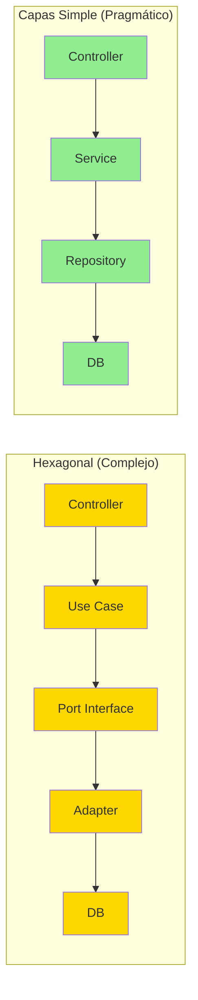
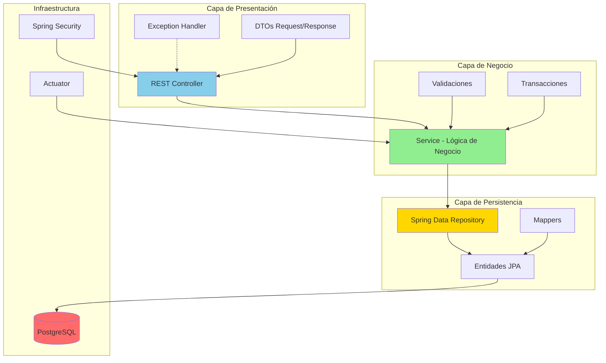
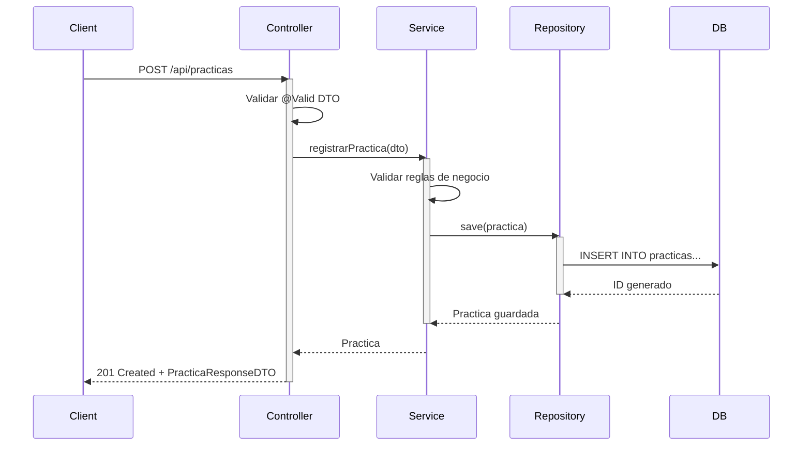
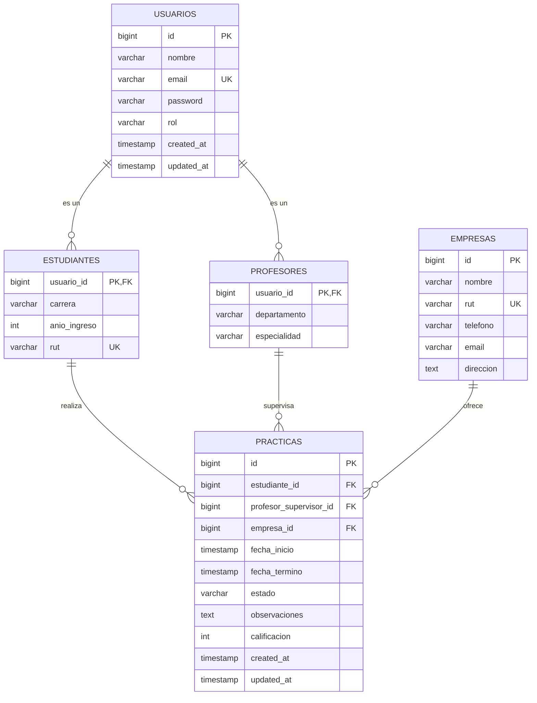
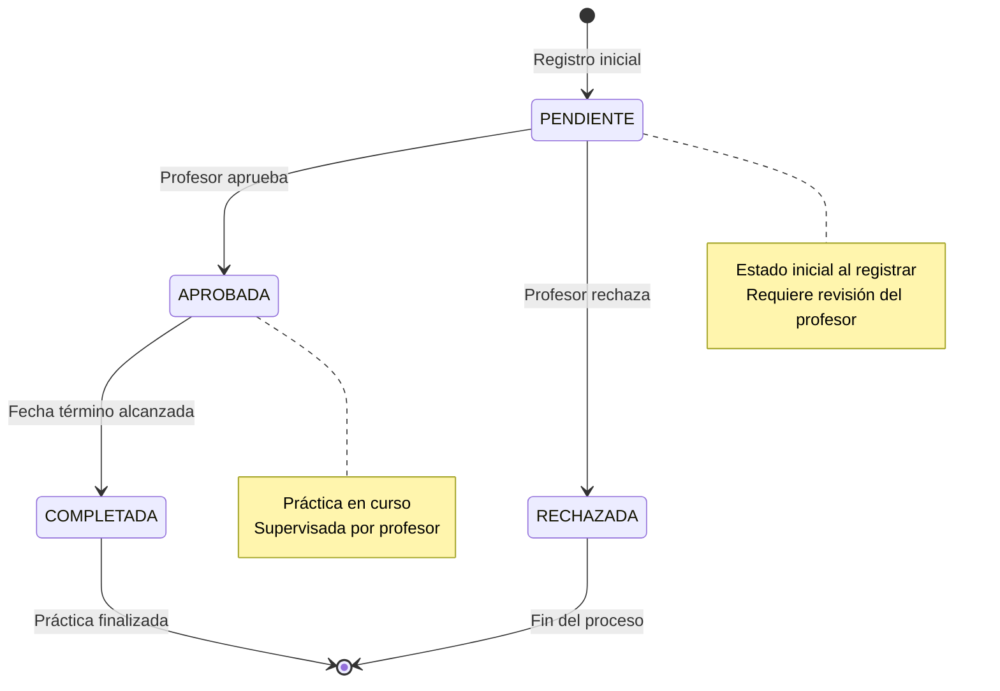

# Sistema de Gestión de Prácticas Profesionales (SGPP)

## INVESTIGACIÓN Y PLANIFICACIÓN

**Proyecto:** Sistema de seguimiento de prácticas para colegio técnico  
**Arquitectura:** En Capas Simple (Layered Architecture)  
**Stack Tecnológico:** Java 21, Spring Boot 3.58, Spring Data JPA, PostgreSQL  
**Versión:** 1.0  
**Fecha:** Diciembre 2025

---

## 🎯 Filosofía de Esta Versión

**Menos abstracción, más pragmatismo.**

Este documento presenta una arquitectura **simple, directa y mantenible** que aprovecha las convenciones de Spring Boot sin agregar complejidad innecesaria. Perfecta para equipos pequeños, proyectos educativos y sistemas CRUD con lógica de negocio moderada.

---

## Tabla de Contenidos

1. [Análisis y Justificación Técnica](#fase-1-análisis-y-justificación-técnica)
2. [Arquitectura del Sistema](#fase-2-arquitectura-del-sistema)
3. [Diseño de Base de Datos](#fase-3-diseño-de-base-de-datos)
4. [Estructura del Proyecto](#fase-4-estructura-del-proyecto)

---

## FASE 1: ANÁLISIS Y JUSTIFICACIÓN TÉCNICA

### 1.1. ¿Por qué PostgreSQL?

**Seleccionamos PostgreSQL sobre otras alternativas:**

| Característica             | PostgreSQL       | MySQL          | MongoDB     |
| -------------------------- | ---------------- | -------------- | ----------- |
| **Integridad Referencial** | ✅ Excelente     | ✅ Buena       | ❌ Limitada |
| **ACID Completo**          | ✅               | ✅             | ⚠️ Parcial  |
| **JSONB (Flexibilidad)**   | ✅ Nativo        | ⚠️ JSON básico | ✅ Nativo   |
| **Concurrencia**           | ✅ MVCC avanzado | ⚠️ Bloqueos    | ✅ Buena    |
| **Auditoría**              | ✅ Excelente     | ⚠️ Manual      | ⚠️ Manual   |
| **Madurez**                | ✅ 30+ años      | ✅ 25+ años    | ⚠️ 15 años  |

**Conclusión:** PostgreSQL ofrece el mejor balance para un sistema transaccional con necesidades de integridad estricta.

### 1.2. ¿Por qué Arquitectura en Capas Simple?

**Comparación con alternativas:**



**Razones para elegir arquitectura simple:**

✅ **Proyecto CRUD-dominante:** 80% de operaciones son crear/leer/actualizar/eliminar  
✅ **Equipo pequeño:** 1-3 desarrolladores, contexto educativo  
✅ **Lógica de negocio moderada:** Validaciones y estados, no algoritmos complejos  
✅ **Tiempo limitado:** Necesidad de entregar valor rápidamente  
✅ **Bajo riesgo de cambio tecnológico:** Stack establecido (Spring Boot + PostgreSQL)  
✅ **Mantenibilidad:** Más fácil para nuevos desarrolladores

### 1.3. Principios de Diseño

1. **KISS (Keep It Simple, Stupid):** Simplicidad sobre abstracción excesiva
2. **YAGNI (You Aren't Gonna Need It):** No diseñar para el futuro incierto
3. **Convención sobre Configuración:** Aprovechar Spring Boot
4. **Separación de Responsabilidades:** Pero sin sobre-ingeniería
5. **Testing Práctico:** Enfocado en lógica crítica, no 100% de cobertura

---

## FASE 2: ARQUITECTURA DEL SISTEMA

### 2.1. Vista General



### 2.2. Responsabilidades por Capa

| Capa           | Responsabilidad                                                      | Tecnologías                                        | Ejemplos             |
| -------------- | -------------------------------------------------------------------- | -------------------------------------------------- | -------------------- |
| **Controller** | - Recibir requests HTTP<br>- Validar entrada<br>- Retornar responses | `@RestController`<br>`@RequestMapping`<br>`@Valid` | `PracticaController` |
| **Service**    | - Lógica de negocio<br>- Transacciones<br>- Orquestación             | `@Service`<br>`@Transactional`                     | `PracticaService`    |
| **Repository** | - Acceso a datos<br>- Queries                                        | `@Repository`<br>Spring Data JPA                   | `PracticaRepository` |
| **Entity**     | - Modelo de datos<br>- Lógica de dominio simple                      | `@Entity`<br>`@Table`                              | `Practica`           |
| **DTO**        | - Transferencia de datos<br>- Contratos API                          | Java Records<br>Bean Validation                    | `PracticaRequestDTO` |

### 2.3. Flujo de una Petición



---

## FASE 3: DISEÑO DE BASE DE DATOS

### 3.1. Modelo Entidad-Relación



### 3.2. Script SQL de Creación

```sql
-- Tabla base de usuarios
CREATE TABLE usuarios (
    id BIGSERIAL PRIMARY KEY,
    nombre VARCHAR(200) NOT NULL,
    email VARCHAR(150) NOT NULL UNIQUE,
    password VARCHAR(255) NOT NULL,
    rol VARCHAR(50) NOT NULL,
    created_at TIMESTAMP NOT NULL DEFAULT CURRENT_TIMESTAMP,
    updated_at TIMESTAMP NOT NULL DEFAULT CURRENT_TIMESTAMP
);

-- Índice para búsquedas por email (login frecuente)
CREATE INDEX idx_usuarios_email ON usuarios(email);

-- Tabla de estudiantes
CREATE TABLE estudiantes (
    usuario_id BIGINT PRIMARY KEY,
    carrera VARCHAR(100) NOT NULL,
    anio_ingreso INTEGER NOT NULL CHECK (anio_ingreso >= 2000 AND anio_ingreso <= 2100),
    rut VARCHAR(12) NOT NULL UNIQUE,
    CONSTRAINT fk_estudiante_usuario
        FOREIGN KEY (usuario_id) REFERENCES usuarios(id) ON DELETE CASCADE
);

-- Tabla de profesores
CREATE TABLE profesores (
    usuario_id BIGINT PRIMARY KEY,
    departamento VARCHAR(100),
    especialidad VARCHAR(100),
    CONSTRAINT fk_profesor_usuario
        FOREIGN KEY (usuario_id) REFERENCES usuarios(id) ON DELETE CASCADE
);

-- Tabla de empresas
CREATE TABLE empresas (
    id BIGSERIAL PRIMARY KEY,
    nombre VARCHAR(200) NOT NULL,
    rut VARCHAR(12) NOT NULL UNIQUE,
    telefono VARCHAR(20),
    email VARCHAR(150),
    direccion TEXT,
    created_at TIMESTAMP NOT NULL DEFAULT CURRENT_TIMESTAMP
);

-- Tabla de prácticas
CREATE TABLE practicas (
    id BIGSERIAL PRIMARY KEY,
    estudiante_id BIGINT NOT NULL,
    profesor_supervisor_id BIGINT,
    empresa_id BIGINT NOT NULL,
    fecha_inicio TIMESTAMP NOT NULL,
    fecha_termino TIMESTAMP NOT NULL,
    estado VARCHAR(50) NOT NULL DEFAULT 'PENDIENTE',
    observaciones TEXT,
    calificacion INTEGER CHECK (calificacion >= 1 AND calificacion <= 7),
    created_at TIMESTAMP NOT NULL DEFAULT CURRENT_TIMESTAMP,
    updated_at TIMESTAMP NOT NULL DEFAULT CURRENT_TIMESTAMP,

    CONSTRAINT fk_practica_estudiante
        FOREIGN KEY (estudiante_id) REFERENCES estudiantes(usuario_id),
    CONSTRAINT fk_practica_profesor
        FOREIGN KEY (profesor_supervisor_id) REFERENCES profesores(usuario_id),
    CONSTRAINT fk_practica_empresa
        FOREIGN KEY (empresa_id) REFERENCES empresas(id),
    CONSTRAINT chk_fechas
        CHECK (fecha_termino > fecha_inicio)
);

-- Índices para optimización de consultas frecuentes
CREATE INDEX idx_practicas_estudiante ON practicas(estudiante_id);
CREATE INDEX idx_practicas_estado ON practicas(estado);
CREATE INDEX idx_practicas_profesor ON practicas(profesor_supervisor_id);
CREATE INDEX idx_practicas_fechas ON practicas(fecha_inicio, fecha_termino);

-- Trigger para actualizar updated_at automáticamente
CREATE OR REPLACE FUNCTION update_updated_at_column()
RETURNS TRIGGER AS $$
BEGIN
    NEW.updated_at = CURRENT_TIMESTAMP;
    RETURN NEW;
END;
$$ LANGUAGE plpgsql;

CREATE TRIGGER update_usuarios_updated_at BEFORE UPDATE ON usuarios
    FOR EACH ROW EXECUTE FUNCTION update_updated_at_column();

CREATE TRIGGER update_practicas_updated_at BEFORE UPDATE ON practicas
    FOR EACH ROW EXECUTE FUNCTION update_updated_at_column();

-- Datos iniciales para testing
INSERT INTO usuarios (nombre, email, password, rol) VALUES
('Admin Sistema', 'admin@colegio.cl', '$2a$12$LQv3c1yqBWVHxkd0LHAkCOYz6TtxMQJqhN8/LewY5IsGZPg3rGtxu', 'ROLE_ADMIN'),
('Juan Pérez', 'juan.perez@colegio.cl', '$2a$12$LQv3c1yqBWVHxkd0LHAkCOYz6TtxMQJqhN8/LewY5IsGZPg3rGtxu', 'ROLE_PROFESOR'),
('María González', 'maria.gonzalez@estudiante.cl', '$2a$12$LQv3c1yqBWVHxkd0LHAkCOYz6TtxMQJqhN8/LewY5IsGZPg3rGtxu', 'ROLE_ESTUDIANTE');

INSERT INTO profesores (usuario_id, departamento, especialidad) VALUES
(2, 'Informática', 'Desarrollo de Software');

INSERT INTO estudiantes (usuario_id, carrera, anio_ingreso, rut) VALUES
(3, 'Técnico en Programación', 2024, '12345678-9');

INSERT INTO empresas (nombre, rut, telefono, email, direccion) VALUES
('TechCorp SpA', '76123456-7', '+56912345678', 'rrhh@techcorp.cl', 'Av. Providencia 123, Santiago');
```

### 3.3. Estados de Práctica



---

## FASE 4: ESTRUCTURA DEL PROYECTO

### 4.1. Árbol de Directorios

```
src/main/java/cl/colegio/sgpp/
├── SgppApplication.java              # Clase principal
│
├── controller/                        # Capa de Presentación
│   ├── PracticaController.java
│   ├── EstudianteController.java
│   ├── ProfesorController.java
│   └── EmpresaController.java
│
├── service/                           # Capa de Negocio
│   ├── PracticaService.java
│   ├── EstudianteService.java
│   ├── ProfesorService.java
│   ├── EmpresaService.java
│   └── AuthService.java
│
├── repository/                        # Capa de Persistencia
│   ├── PracticaRepository.java
│   ├── EstudianteRepository.java
│   ├── ProfesorRepository.java
│   ├── EmpresaRepository.java
│   └── UsuarioRepository.java
│
├── model/
│   ├── entity/                        # Entidades JPA
│   │   ├── Usuario.java
│   │   ├── Estudiante.java
│   │   ├── Profesor.java
│   │   ├── Empresa.java
│   │   └── Practica.java
│   │
│   └── dto/                           # Data Transfer Objects
│       ├── request/
│       │   ├── PracticaRequestDTO.java
│       │   ├── EstudianteRequestDTO.java
│       │   └── LoginRequestDTO.java
│       └── response/
│           ├── PracticaResponseDTO.java
│           ├── EstudianteResponseDTO.java
│           └── ErrorResponseDTO.java
│
├── exception/                         # Manejo de Errores
│   ├── GlobalExceptionHandler.java
│   ├── ResourceNotFoundException.java
│   ├── BusinessException.java
│   └── ValidationException.java
│
├── config/                            # Configuraciones
│   ├── SecurityConfig.java
│   ├── OpenAPIConfig.java
│   └── CorsConfig.java
│
├── security/                          # Seguridad
│   ├── JwtTokenProvider.java
│   ├── CustomUserDetailsService.java
│   └── JwtAuthenticationFilter.java
│
└── util/                              # Utilidades
    ├── DateUtils.java
    ├── ValidationUtils.java
    └── Constants.java

src/main/resources/
├── application.properties             # Configuración principal
├── application-dev.properties         # Perfil desarrollo
├── application-prod.properties        # Perfil producción
└── db/
    └── migration/                     # Scripts Flyway
        ├── V1__Create_Tables.sql
        ├── V2__Add_Indexes.sql
        └── V3__Initial_Data.sql

src/test/java/cl/colegio/sgpp/
├── controller/
│   └── PracticaControllerTest.java
├── service/
│   └── PracticaServiceTest.java
└── repository/
    └── PracticaRepositoryTest.java
```

### 4.2. Dependencias Maven (pom.xml)

Ver en [IMPLEMENTACION.MD](./IMPLEMENTACION.MD) el archivo `pom.xml` completo con todas las dependencias necesarias.

**Principales dependencias:**

- Spring Boot Starter Web
- Spring Boot Starter Data JPA
- Spring Boot Starter Security
- Spring Boot Starter Validation
- PostgreSQL Driver
- Flyway Migration
- SpringDoc OpenAPI
- JWT (jjwt)
- Lombok
- Testing (JUnit, Mockito, Spring Test)

---

## Próximos Pasos

Consulta el documento [IMPLEMENTACION.MD](./IMPLEMENTACION.MD) para ver:

- Implementación completa de todas las capas (Entidades, Repositorios, Servicios, Controladores)
- Código fuente detallado de cada componente
- Configuración de seguridad con Spring Security
- Validaciones y manejo de errores
- Tests unitarios y de integración
- Configuración de aplicación y perfiles
- Guía de despliegue
