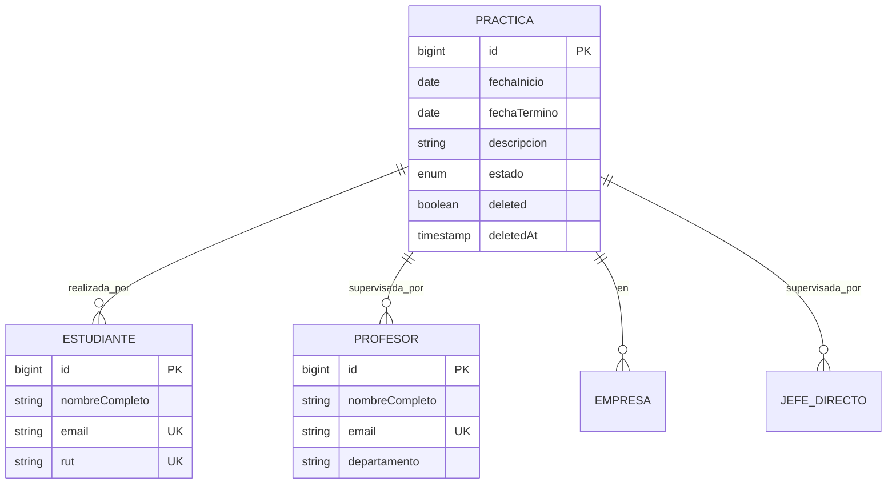

# 🎓 Sistema de Gestión de Prácticas Profesionales (SGPP)

[](https://spring.io/projects/spring-boot)
[](https://openjdk.org/)
[](https://www.postgresql.org/)
[](https://hibernate.org/)
[](LICENSE)

Sistema backend RESTful para la gestión integral de prácticas profesionales en instituciones educativas. Permite a estudiantes gestionar sus prácticas y a profesores supervisar el progreso de las mismas mediante una API documentada con OpenAPI/Swagger.

---

## 📋 Tabla de Contenidos

- [Características](#-características)
- [Tecnologías](#-tecnologías)
- [Arquitectura](#-arquitectura)
- [Requisitos Previos](#-requisitos-previos)
- [Instalación](#-instalación)
- [Configuración](#-configuración)
- [Ejecución](#-ejecución)
- [API Endpoints](#-api-endpoints)
- [Base de Datos](#-base-de-datos)
- [Documentación Adicional](#-documentación-adicional)
- [Estado del Proyecto](#-estado-del-proyecto)
- [Contribuir](#-contribuir)

---

## ✨ Características

### Gestión de Prácticas (CRUD Completo)

- ✅ Crear nueva práctica con validaciones de negocio
- ✅ Consultar prácticas (individual, todas, por estudiante, por profesor)
- ✅ Actualizar información de práctica existente
- ✅ Cambiar estado de práctica (PENDIENTE → EN_CURSO → COMPLETADA)
- ✅ Eliminar práctica con **soft delete** (no se borra físicamente)

### Consultas de Entidades

- 👨‍🎓 **Estudiantes:** Listar todos, buscar por ID/email/RUT
- 👨‍🏫 **Profesores:** Listar todos, buscar por ID/email/departamento
- 🏢 **Empresas:** Listar todas, buscar por ID/RUT/nombre
- 👔 **Jefes Directos:** Listar todos, buscar por ID/nombre

### Validaciones Implementadas

- ✅ Fechas coherentes (fecha inicio < fecha término)
- ✅ Transiciones de estado válidas
- ✅ Relaciones existentes (estudiante, profesor, empresa deben existir)
- ✅ RUTs únicos para estudiantes y empresas
- ✅ Emails únicos para estudiantes y profesores
- ✅ Validación automática de DTOs con `@Valid`

### Características Técnicas

- 🔄 **Auditoría automática** (createdAt, updatedAt) con JPA Auditing
- 🗑️ **Soft Delete** en prácticas con timestamp de eliminación
- 📝 **Documentación API completa** con Swagger UI
- 🛡️ **Manejo robusto de errores** con respuestas JSON estandarizadas
- 🗄️ **Migraciones versionadas** con Flyway
- 🎯 **Separación por roles** (endpoints específicos para estudiantes y profesores)

---

## 🛠️ Tecnologías

### Backend

- **Spring Boot 3.5.8** - Framework principal
- **Java 21** - Lenguaje de programación
- **Spring Data JPA** - Persistencia y ORM
- **Hibernate** - Implementación JPA
- **Jakarta Bean Validation** - Validaciones

### Base de Datos

- **PostgreSQL 17.7** - Base de datos relacional
- **Flyway 9.22.3** - Migraciones versionadas

### Documentación

- **SpringDoc OpenAPI 2.7.0** - Documentación automática de API
- **Swagger UI** - Interfaz interactiva para probar endpoints

### Herramientas

- **Lombok** - Reducción de código boilerplate
- **Maven** - Gestión de dependencias
- **Spring Boot DevTools** - Hot reload en desarrollo

---

## 🏗️ Arquitectura

### Patrón de Capas

```
┌─────────────────────────────────────────────┐
│         Controller Layer (REST API)         │
│  - Validación de entrada con @Valid        │
│  - Manejo de HTTP requests/responses        │
└─────────────────┬───────────────────────────┘
                  │ DTOs
┌─────────────────▼───────────────────────────┐
│          Service Layer (Business)           │
│  - Lógica de negocio                       │
│  - Validaciones complejas                   │
│  - Transformación DTO ↔ Entity             │
└─────────────────┬───────────────────────────┘
                  │ Entities
┌─────────────────▼───────────────────────────┐
│       Repository Layer (Data Access)        │
│  - Queries JPA                             │
│  - Métodos custom con @Query                │
└─────────────────┬───────────────────────────┘
                  │
┌─────────────────▼───────────────────────────┐
│          PostgreSQL Database                │
└─────────────────────────────────────────────┘
```

### Entidades Principales



### Flujo de Request

```
1. HTTP Request → Controller
2. Controller valida DTO con @Valid
3. Controller llama Service
4. Service aplica lógica de negocio
5. Service llama Repository
6. Repository ejecuta query JPA
7. Entity → Service → DTO
8. Controller devuelve ResponseEntity<DTO>
```

---

## 📦 Requisitos Previos

Antes de instalar, asegúrate de tener:

- ✅ **Java 21** o superior ([Descargar OpenJDK](https://adoptium.net/))
- ✅ **Maven 3.9+** ([Descargar Maven](https://maven.apache.org/download.cgi))
- ✅ **PostgreSQL 17** ([Descargar PostgreSQL](https://www.postgresql.org/download/))
- ✅ **Git** ([Descargar Git](https://git-scm.com/downloads))

### Verificar instalación

```bash
java -version    # Debe mostrar: openjdk version "21.x.x"
mvn -version     # Debe mostrar: Apache Maven 3.9.x
psql --version   # Debe mostrar: psql (PostgreSQL) 17.x
git --version    # Debe mostrar: git version 2.x.x
```

---

## 🚀 Instalación

### 1. Clonar el repositorio

```bash
git clone https://github.com/felipeDev303/sgpp.git
cd sgpp
```

### 2. Crear base de datos PostgreSQL

```bash
# Conectar a PostgreSQL
psql -U postgres

# Ejecutar en psql:
CREATE DATABASE sgpp_db;
CREATE USER sgpp_user WITH ENCRYPTED PASSWORD 'sgpp_password';
GRANT ALL PRIVILEGES ON DATABASE sgpp_db TO sgpp_user;
\q
```

### 3. Configurar aplicación

Edita `src/main/resources/application.properties`:

```properties
# Base de datos - Ajusta si cambiaste nombre/usuario/password
spring.datasource.url=jdbc:postgresql://localhost:5432/sgpp_db
spring.datasource.username=sgpp_user
spring.datasource.password=sgpp_password

# JPA/Hibernate
spring.jpa.hibernate.ddl-auto=none
spring.jpa.show-sql=true
spring.jpa.properties.hibernate.format_sql=true

# Flyway (migraciones automáticas)
spring.flyway.enabled=true
spring.flyway.baseline-on-migrate=true

# Swagger UI
springdoc.api-docs.path=/v3/api-docs
springdoc.swagger-ui.path=/swagger-ui.html
```

### 4. Compilar proyecto

```bash
mvn clean install
```

Si todo está bien, verás:

```
[INFO] BUILD SUCCESS
[INFO] Total time: XX s
```

---

## ⚙️ Configuración

### Variables de Entorno (Opcional)

Para mayor seguridad en producción, usa variables de entorno:

```bash
# Linux/Mac
export DB_URL="jdbc:postgresql://localhost:5432/sgpp_db"
export DB_USERNAME="sgpp_user"
export DB_PASSWORD="sgpp_password"

# Windows (PowerShell)
$env:DB_URL="jdbc:postgresql://localhost:5432/sgpp_db"
$env:DB_USERNAME="sgpp_user"
$env:DB_PASSWORD="sgpp_password"
```

Y modifica `application.properties`:

```properties
spring.datasource.url=${DB_URL}
spring.datasource.username=${DB_USERNAME}
spring.datasource.password=${DB_PASSWORD}
```

---

## ▶️ Ejecución

### Modo Desarrollo (con hot reload)

```bash
mvn spring-boot:run
```

O usando Maven Wrapper (incluido en el proyecto):

```bash
# Linux/Mac
./mvnw spring-boot:run

# Windows
mvnw.cmd spring-boot:run
```

### Modo Producción (JAR)

```bash
# 1. Compilar JAR
mvn clean package -DskipTests

# 2. Ejecutar JAR
java -jar target/sgpp-0.0.1-SNAPSHOT.jar
```

### Verificar que está funcionando

La aplicación iniciará en `http://localhost:8080`

```bash
# Probar endpoint de empresas
curl http://localhost:8080/api/v1/empresas

# Debe responder con código 200 y JSON con lista de empresas
```

### Acceder a Swagger UI

Abre en tu navegador: **http://localhost:8080/swagger-ui/index.html**

Verás la documentación interactiva de toda la API con ejemplos y posibilidad de probar endpoints directamente.

### Probar con Postman

Puedes importar la colección de endpoints desde [API-TEST-REPORT.md](API-TEST-REPORT.md) o probar manualmente:

```bash
# GET - Listar empresas
GET http://localhost:8080/api/v1/empresas

# GET - Listar estudiantes
GET http://localhost:8080/api/v1/estudiantes

# GET - Listar profesores
GET http://localhost:8080/api/v1/profesores

# GET - Listar jefes directos
GET http://localhost:8080/api/v1/jefes-directos
```

---

## 🌐 API Endpoints

### 📝 Prácticas - Estudiantes

| Método | Endpoint                             | Descripción                     |
| ------ | ------------------------------------ | ------------------------------- |
| GET    | `/api/v1/estudiantes/practicas`      | Listar prácticas del estudiante |
| POST   | `/api/v1/estudiantes/practicas`      | Crear nueva práctica            |
| GET    | `/api/v1/estudiantes/practicas/{id}` | Ver detalle de práctica         |
| PUT    | `/api/v1/estudiantes/practicas/{id}` | Actualizar práctica             |
| DELETE | `/api/v1/estudiantes/practicas/{id}` | Eliminar práctica (soft delete) |

### 👨‍🏫 Prácticas - Profesores

| Método | Endpoint                                   | Descripción                   |
| ------ | ------------------------------------------ | ----------------------------- |
| GET    | `/api/v1/profesores/practicas`             | Listar prácticas supervisadas |
| GET    | `/api/v1/profesores/practicas/{id}`        | Ver detalle de práctica       |
| PATCH  | `/api/v1/profesores/practicas/{id}/estado` | Cambiar estado de práctica    |

### 👨‍🎓 Estudiantes (Solo Lectura)

| Método | Endpoint                            | Descripción      |
| ------ | ----------------------------------- | ---------------- |
| GET    | `/api/v1/estudiantes`               | Listar todos     |
| GET    | `/api/v1/estudiantes/{id}`          | Buscar por ID    |
| GET    | `/api/v1/estudiantes/email/{email}` | Buscar por email |
| GET    | `/api/v1/estudiantes/rut/{rut}`     | Buscar por RUT   |

### 👨‍🏫 Profesores (Solo Lectura)

| Método | Endpoint                                         | Descripción             |
| ------ | ------------------------------------------------ | ----------------------- |
| GET    | `/api/v1/profesores`                             | Listar todos            |
| GET    | `/api/v1/profesores/{id}`                        | Buscar por ID           |
| GET    | `/api/v1/profesores/email/{email}`               | Buscar por email        |
| GET    | `/api/v1/profesores/departamento/{departamento}` | Buscar por departamento |

### 🏢 Empresas (Solo Lectura)

| Método | Endpoint                           | Descripción       |
| ------ | ---------------------------------- | ----------------- |
| GET    | `/api/v1/empresas`                 | Listar todas      |
| GET    | `/api/v1/empresas/{id}`            | Buscar por ID     |
| GET    | `/api/v1/empresas/rut/{rut}`       | Buscar por RUT    |
| GET    | `/api/v1/empresas/nombre/{nombre}` | Buscar por nombre |

### 👔 Jefes Directos (Solo Lectura)

| Método | Endpoint                                 | Descripción       |
| ------ | ---------------------------------------- | ----------------- |
| GET    | `/api/v1/jefes-directos`                 | Listar todos      |
| GET    | `/api/v1/jefes-directos/{id}`            | Buscar por ID     |
| GET    | `/api/v1/jefes-directos/buscar?nombre=x` | Buscar por nombre |

### Ejemplo de Request

**POST /api/v1/estudiantes/practicas**

```json
{
  "fechaInicio": "2025-03-01",
  "fechaTermino": "2025-06-30",
  "descripcion": "Práctica de desarrollo backend en empresa tecnológica",
  "estudianteId": 1,
  "profesorId": 2,
  "empresaId": 3,
  "jefeDirectoId": 4
}
```

**Response 201 Created:**

```json
{
  "id": 10,
  "fechaInicio": "2025-03-01",
  "fechaTermino": "2025-06-30",
  "descripcion": "Práctica de desarrollo backend en empresa tecnológica",
  "estado": "PENDIENTE",
  "estudiante": {
    "id": 1,
    "nombreCompleto": "Juan Pérez",
    "email": "juan.perez@example.com"
  },
  "profesor": {
    "id": 2,
    "nombreCompleto": "Dr. María González",
    "departamento": "Ingeniería Informática"
  },
  "empresa": {
    "id": 3,
    "nombre": "Tech Solutions SpA",
    "rut": "76.123.456-7"
  },
  "jefeDirecto": {
    "id": 4,
    "nombre": "Carlos Rodríguez",
    "contacto": "carlos.r@techsolutions.cl"
  },
  "createdAt": "2025-12-11T15:30:00",
  "updatedAt": "2025-12-11T15:30:00"
}
```

---

## 🗄️ Base de Datos

### Migraciones con Flyway

Las migraciones se aplican automáticamente al iniciar la aplicación:

```
src/main/resources/db/migrations/
├── V1__Create_User_Tables.sql          # Tablas de usuarios
├── V2__Create_Practica_Table.sql       # Tabla prácticas
├── V3__Add_Estado_To_Practica.sql      # Campo estado
├── V4__Initial_Data.sql                # Datos de prueba
├── V5__Add_Audit_Fields.sql            # Auditoría
├── V6__Add_Soft_Delete_To_Practica.sql # Soft delete
├── V7__Remove_Audit_User_Fields.sql    # Simplificación
└── V8__Simplify_Estado_Practica.sql    # Estados básicos
```

### Esquema de Base de Datos

**Tablas principales:**

- `estudiantes` - Estudiantes del sistema
- `profesores` - Profesores supervisores
- `empresas` - Empresas donde se realizan prácticas
- `jefes_directos` - Supervisores en empresas
- `practicas` - Prácticas profesionales (con soft delete)

**Relaciones:**

- Práctica → Estudiante (muchos a uno)
- Práctica → Profesor (muchos a uno)
- Práctica → Empresa (muchos a uno)
- Práctica → JefeDirecto (muchos a uno)

### Datos de Prueba

El sistema incluye datos iniciales en `V4__Initial_Data.sql`:

- 3 estudiantes
- 2 profesores
- 2 empresas
- 2 jefes directos
- 4 prácticas de ejemplo

---

## 📚 Documentación Adicional

- **[API-TEST-REPORT.md](API-TEST-REPORT.md)** - Reporte de pruebas de API con ejemplos
- **[CONTEXT.MD](CONTEXT.MD)** - Arquitectura detallada y tecnologías
- **[IMPLEMENTACION.MD](IMPLEMENTACION.MD)** - Guía de implementación y despliegue
- **[INVESTIGACION-PLANIFICACION.MD](INVESTIGACION-PLANIFICACION.MD)** - Plan de investigación inicial
- **[PROYECTO-RESUMEN.MD](PROYECTO-RESUMEN.MD)** - Resumen consolidado del estado

---

## 📊 Estado del Proyecto

### ✅ Proyecto Completado - 100%

**Sprints Completados:**

- ✅ Sprint 1: DTOs y Manejo de Errores (8/8 PRs)
- ✅ Sprint 2: Servicios y Controladores (7/7 PRs)
- ✅ Sprint 3: Migraciones y Auditoría (6/6 PRs)
- ✅ Sprint 3.5: Correcciones y Simplificaciones (3/3 PRs)
- ✅ Sprint 4: Documentación Swagger (8/8 PRs)
- ✅ Sprint 5: Limpieza de código deprecado (4/4 PRs)
- ✅ Sprint 6: Testing y Documentación final

**Última actualización:** 14 de diciembre de 2025

### Características Implementadas

| Funcionalidad           | Estado  | Sprint |
| ----------------------- | ------- | ------ |
| CRUD Prácticas          | ✅ 100% | 1-2    |
| Consultas Entidades     | ✅ 100% | 2      |
| Validaciones de Negocio | ✅ 100% | 2      |
| Manejo de Errores       | ✅ 100% | 1      |
| Auditoría JPA           | ✅ 100% | 3      |
| Soft Delete             | ✅ 100% | 3.5    |
| Documentación Swagger   | ✅ 100% | 4      |
| Separación por Roles    | ✅ 100% | 3.5    |
| Limpieza Código         | ✅ 100% | 5      |
| Testing API             | ✅ 100% | 6      |
| Documentación README    | ✅ 100% | 6      |

### Fuera de Alcance (Opcional)

Estas características no son necesarias para un proyecto académico básico:

- ⚪ Spring Security + JWT (complejidad alta)
- ⚪ Tests unitarios y de integración
- ⚪ Perfiles dev/prod separados
- ⚪ CORS para frontend
- ⚪ Dockerización

---

## 🤝 Contribuir

### Flujo de Trabajo Git

```bash
# 1. Crear rama desde dev
git checkout dev
git pull origin dev
git checkout -b feature/nueva-funcionalidad

# 2. Hacer commits
git add .
git commit -m "feat: descripción del cambio"

# 3. Push y crear PR
git push origin feature/nueva-funcionalidad
# Crear Pull Request en GitHub hacia rama 'dev'
```

### Convenciones de Código

- **Java:** Estilo estándar de Google Java
- **Commits:** Conventional Commits (feat, fix, docs, refactor, etc.)
- **PRs:** Un PR = Una funcionalidad atómica
- **Testing:** Probar manualmente con Swagger UI antes de PR

---

## 📄 Licencia

Este proyecto es de carácter **académico** y se distribuye con fines educativos.

---

## 👥 Autores

**SGPP Team** - Instituto Profesional Santo Tomás

---

## 📞 Soporte

Para preguntas o problemas:

1. Revisa la documentación en `/docs`
2. Consulta Swagger UI en desarrollo
3. Crea un issue en GitHub

---

## 🎉 Agradecimientos

- Spring Boot Team por el excelente framework
- PostgreSQL por la base de datos robusta
- SpringDoc por la integración con OpenAPI/Swagger

---

**¡El sistema está listo para usar! 🚀**

Inicia con `mvn spring-boot:run` y explora la API en http://localhost:8080/swagger-ui.html
